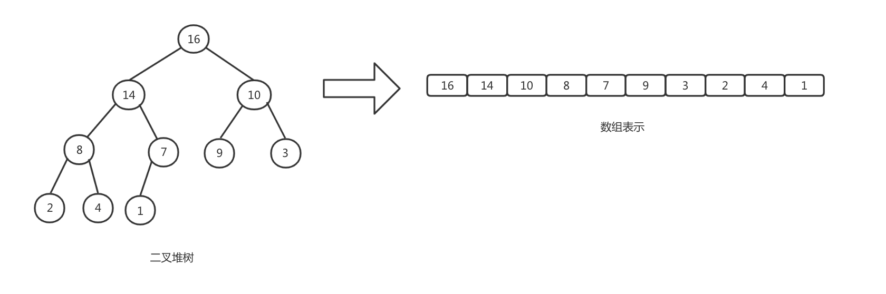

# 堆排序
堆排序时间复杂度为Ο(nlgn)，并且具有空间原址性。同时堆排序还引入了另一种设计技巧：使用堆的数据结构进行信息管理

## 堆
二叉堆可以近似看成一颗完全二叉树，除了叶子节点，该树是被完全填充，并且是从左到右填充，表示堆的数组包含两个属性，A.length表示数组元素个数；
A.heap-size表示有多少个堆元素存储在该数组中。0 ≤ A.heap-size ≤ A.length,根节点为A[1]，父节点为i/2, 左孩子为2i，右孩子为2i + 1.


通过将i的值左移一位，LEFT过程可以在一条指令内计算2i,RIGHT过程可以通过将i左移1位并在低位加1，得到2i + 1.PARENT可以将i右移一位得到i/2

二叉堆可以分为两种形式

- 最大堆

- 最小堆

### 最大堆
最大堆是指除根以外的所有节点i都要满足：A[PARENT(i)] ≥ A[i]。某个结点的值至多与其父结点一样，堆中的最大元素存放在根结点中，在任意子数中，
该子树中所有节点的值都不大于该子树根节点值

### 最小堆
最小堆指除根结点外的所有节点i都满足：A[PARENT(i)] ≤ A[i].最小堆的最小元素存放在根节点中，最小堆通常用于构造优先队列

## 维护堆的性质
MAX-HEAPIFY是用于维护最大堆性质的重要过程。其时间复杂度为Ο(lgn)。其接收一个数组A和下标i，假定根节点为LEFT(i)和RIGHT(i)的二叉树都是最大
堆，A[i]可能小于其孩子，我们通过让A[i]的值在最大堆中逐级下降，从而使得以下标i为根节点的子树重新遵循最大堆性质
```
MAX-HEAPIFY(A, i)
1   l = LEFT(i)
2   r = RIGHT(i)
3   if l ≤ A.heap-size and A[l] > A[i]
4       largest = l
5   else largest = i
6   if r ≤ A.heap-size and A[r] > A[largest]
7       largest = r
8   if largest ≠ i
9       exchange A[i] with A[largest]
10      MAX-HEAPIFY(A, largest)
```
算法首先从A[i]、A[LEFT(i)]、A[RIGHT(i)]中选出最大值，并将下标存储在largest中。如果A[i]是最大值，则该子树为最大堆。若A[i]不是最大值，则
最大值为其某个孩子，交换A[i]、A[largest]，使i及其孩子满足最大堆。在交换后下标为largest节点的值为原来的A[i],以该节点为根的子树有可能也违反
了最大堆性质，需要递归调用MAX-HEAPIFY

MAX-HEAPIFY时间代价包括：调整A[i]、A[LEFT(i)]、A[RIGHT(i)]关系的时间代价，加上一颗以i的一个孩子为根节点的子树上运行MAX-HEAPIFY的时间代价。
每个孩子子树的大小至多为2n/3。MAX-HEAPIFY运行时间为

        T(n) ≤ T(2n/3) + θ(1)

因此时间复杂度为T(n) = O(lgn)

## 建堆
可以采用自底向上的方法利用过程MAX-HEAPIFY把一个大小为n=A.length的数组A[1..n]转换为最大堆。子数组A(└n/2┘ + 1..n)中的元素都是数的叶子节点。
过程BUILD-MAX-HEAP对树中其它节点都调用一次MAX-HEAPIFY
```
BUILD-MAX-HEAP(A)
1   A.heap-size = A.length
2   for i = └A.length/2┘ downto 1
3       MAX-HEAPIFY(A, i)
```
## 堆排序算法
堆排序算法利用BUILD_MAX_HEAP将输入数组A[1..n]建成最大堆，n = A.length.因为数组最大元素总在节点A[1], 通过把它与A[n]互换，可以让该元素
放到正确位置。如果从堆中去掉节点n，剩余的结点中，原来根的孩子节点仍然是最大堆，而新的根节点可能违背最大堆性质。为维护最大堆的性质，调用MAX-HEAPIFY(A, 1),
从而在A[1..n-1]上构造一个新的最大堆。堆排序算法会不断重复这一过程，直到堆的大小从n-1降到2
```
HEAPSORT(A)
1   BUILD-MAX-HEAP(A)
2   for i = A.length downto 2
3       exchange A[1] with A[i]
4       A.heap-size = A.heap-size - 1
5       MAX-HEAPIFY(A, 1)
```
第一行建立初始最大堆，第2～5行循环第一次迭代开始前堆大堆的情况和每一次迭代之后最大堆情况。HEAPSORT过程时间复杂度为O(nlgn)。每次BUILD-MAX-HEAP
的时间复杂度为O(n), n-1次调用MAX-HEAPIFY，每次时间为O(lgn)

## Java 实现
```
package com.aim.algorithm.sort.impl;

import com.aim.algorithm.sort.Sort;

public class HeapSort implements Sort {
    @Override
    public int[] sort(int[] input) {
        return heapSort(input);
    }

    private void maxHeapify(int[] input, int heapSize, int i) {
        int l = 2 * i + 1;
        int r = 2 * i + 2;
        int largest = i;
        if (l < heapSize && input[l] > input[i]) {
            largest = l;
        }
        if (r < heapSize && input[r] > input[largest]) {
            largest = r;
        }
        if (largest != i) {
            input[i] = input[i] ^ input[largest];
            input[largest] = input[i] ^ input[largest];
            input[i] = input[i] ^ input[largest];
            maxHeapify(input, heapSize, largest);
        }
    }


    private void buildMaxHeap(int[] input) {
        for (int i = input.length / 2 - 1; i >= 0; i--) {
            maxHeapify(input, input.length, i);
        }
    }

    private int[] heapSort(int[] input) {
        int heapSize = input.length;
        buildMaxHeap(input);
        for (int i = input.length - 1; i >= 1; i--) {
            input[0] = input[0] ^ input[i];
            input[i] = input[0] ^ input[i];
            input[0] = input[0] ^ input[i];
            heapSize--;
            maxHeapify(input, heapSize, 0);
        }
        return input;
    }
}

// 测试方法
public static void heapSort() throws IOException {
    Scanner scan = new Scanner(System.in);
    System.out.println("请输入要排序数组");
    String arrayStr = scan.nextLine();
    while (Strings.isBlank(arrayStr)) {
        System.out.println("请输入要排序数组");
        arrayStr = scan.nextLine();
    }
    String[] arrays = arrayStr.split(" ");
    int[] input = Arrays.stream(arrays).mapToInt(array -> Integer.valueOf(array)).toArray();

    int[] result = heapSort.sort(input);
    Arrays.stream(result).forEach(rsl -> System.out.println(rsl));
}
```

