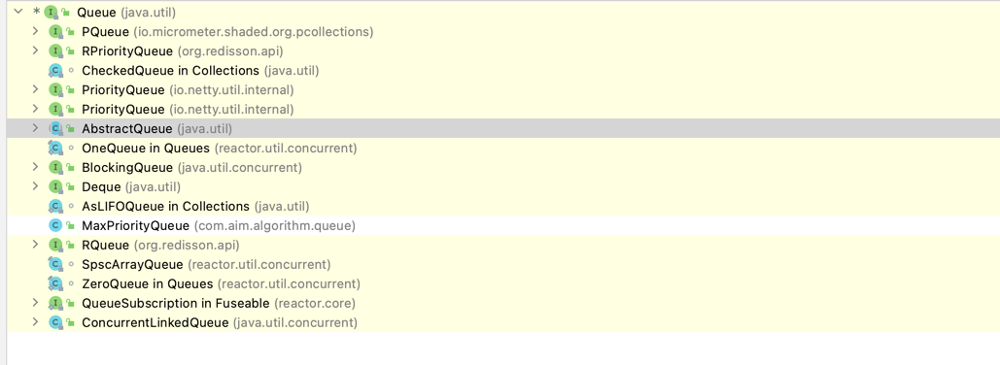

# 栈和队列
栈和队列都是动态集合，在其上进行DELETE操作所移除的元素都是预先设定的。在栈中，被删除的元素是最近插入的元素：栈实现的是一种后进先出(LIFO)
策略；队列中被删除的总是集合中存在时间最长的元素：队列实现的是先进先出（FIFO）策略

## 栈
栈上的INSERT操作被称为压入（push），无参数的DELETE操作称为弹出（pop）。可以使用一个数组S[1..n]来实现一个最多可容纳n个元素的栈，该数组有一个
属性S.top，指向最新插入的元素，栈中包含的元素为S[1..S.top]，其中S[1]是栈底元素，S[S.top]是栈顶元素

当S.top=0时，栈中不包含任何元素，栈为空，要测试一个栈是否为空可以用查询操作STACK-EMPTY，如果对一个空栈执行弹出操作，则称栈下溢，如果S.top
超过top，则称为上溢
```
STACK-EMPTY(S)
1   if S.top == 0
2       return TRUE
3   else return FALSE

PUSH(S, x)
1   S.top = S.top + 1
2   S[S.top] = x

POP(S)
1   if STACK-EMPTY(S)
2       error "underflow"
3   else S.top = S.top -1
4       return S[S.top + 1]
```

### Java Stack源码实现
Stack继承Vector类并提供初始化、入栈、出栈、判空、搜索等一系列操作

#### 入栈
push(E item)入栈操作调用父类Vector的addElement(E obj)方法，该方法上添加synchronized关键字，是线程安全的。addElement方法内部会首先
将modCount加1，然后调用ensureCapacityHelper判断是否需要扩容，如果需要扩容将调用grow(int minCapacity)进行扩容，在扩容方法中会判断是否
设置capacityIncrement，如果设置此属性将此属性设置值进行扩容操作，如果未设置则将容量扩充一倍，并将数据复制到扩容之后的数组。ensureCapacityHelper
方法执行结束后，下一步将需要推入数据放到elementCount++位置，elementCount为未入栈前栈中已有元素数量
```
// 入栈方法
public E push(E item) {
    addElement(item);

    return item;
}

// Vector添加元素方法，线程安全
public synchronized void addElement(E obj) {
    modCount++;
    ensureCapacityHelper(elementCount + 1);
    elementData[elementCount++] = obj;
}

// 判断是否需要扩容
private void ensureCapacityHelper(int minCapacity) {
    // overflow-conscious code
    if (minCapacity - elementData.length > 0)
        grow(minCapacity);
}

// 扩容方法
private void grow(int minCapacity) {
    // overflow-conscious code
    int oldCapacity = elementData.length;
    int newCapacity = oldCapacity + ((capacityIncrement > 0) ?
                                     capacityIncrement : oldCapacity);
    if (newCapacity - minCapacity < 0)
        newCapacity = minCapacity;
    if (newCapacity - MAX_ARRAY_SIZE > 0)
        newCapacity = hugeCapacity(minCapacity);
    elementData = Arrays.copyOf(elementData, newCapacity);
}
```

#### 出栈
pop()出栈操作将栈顶元素取出并移除,线程安全
```
// 取出栈顶元素并移除
public synchronized E pop() {
    E       obj;
    int     len = size();

    obj = peek();
    removeElementAt(len - 1);

    return obj;
}

// 取出栈顶元素
public synchronized E peek() {
    int     len = size();

    if (len == 0)
        throw new EmptyStackException();
    return elementAt(len - 1);
}

// 移除栈顶元素
public synchronized void removeElementAt(int index) {
    modCount++;
    if (index >= elementCount) {
        throw new ArrayIndexOutOfBoundsException(index + " >= " +
                                                 elementCount);
    }
    else if (index < 0) {
        throw new ArrayIndexOutOfBoundsException(index);
    }
    int j = elementCount - index - 1;
    if (j > 0) {
        System.arraycopy(elementData, index + 1, elementData, index, j);
    }
    elementCount--;
    elementData[elementCount] = null; /* to let gc do its work */
}
```

#### 检查是否为空栈
empty()操作检查栈中是否还有元素
```
public boolean empty() {
    return size() == 0;
}
```

## 队列
队列上的INSERT操作称为入队，DELETE操作称为出队，队列遵循先进先出的策略。队列有队头和队尾，当一个元素入队时，被放在队尾的位置，当出队时则从
队头

可以利用数组Q[1..n]来实现一个最多容纳n-1个元素的队列。该队列有一个属性Q.head指向队头元素，属性Q.tail则指向下一个新元素将要插入队位置，
队列中的元素存放在位置Q.head，Q.head + 1, ... , Q.tail - 1，并在最后的位置"环绕"，当Q.head = Q.tail时，队列为空，初始Q.head=Q.tail=1。
如果试图从空队列删除一个元素，队列将发生下溢。当Q.head=Q.tail + 1，队列满，此时尝试插入元素将发生上溢
```
ENQUEUE(Q,x)
1   Q[Q.tail] = x
2   if Q.tail == Q.length
3       Q.tail = 1
4   else Q.tail = Q.tail + 1

DEQUEUE(Q)
1   x = Q[Q.head]
2   if Q.head == Q.length
3       Q.head = 1
4   else Q.head = Q.head + 1
5   return x
```

### Java ArrayBlockingQueue实现
JDK本身实现的队列有很多种，这里我们看一下ArrayBlockingQueue的源码实现


#### 初始化ArrayBlockingQueue
ArrayBlockingQueue提供三个构造函数进行初始化，三个函数都需要传入capacity参数，指定指定阻塞队列的固定容量大小。在构造函数中会初始化一个
指定capacity容量的Object数组，并且初始化ReentrantLock可重入锁，用户可以指定是否是公平锁，默认是非公平锁。初始化锁之后会初始化线程协作
条件notEmpty、notFull

#### 入队操作
入队方法一共有三个，分别提供非阻塞入队、阻塞入队、阻塞超时入队，这三个暴露给用户的入队方法，都会调用私有方法enqueue(E x)，此方法实现真正
的入队操作，并且在结束时会执行notEmpty.signal()，实现唤醒阻塞出队操作。无论是阻塞入队，还是非阻塞入队都被加上了可重入锁
```
// 非阻塞入队，当队列没有空余空间时返回false
public boolean offer(E e) {
    checkNotNull(e);
    final ReentrantLock lock = this.lock;
    lock.lock();
    try {
        if (count == items.length)
            return false;
        else {
            enqueue(e);
            return true;
        }
    } finally {
        lock.unlock();
    }
}

// 阻塞入队，当没有多余空间可以添加新的元素时，将阻塞入队操作，直到被唤醒
public void put(E e) throws InterruptedException {
    checkNotNull(e);
    final ReentrantLock lock = this.lock;
    lock.lockInterruptibly();
    try {
        while (count == items.length)
            notFull.await();
        enqueue(e);
    } finally {
        lock.unlock();
    }
}

// 阻塞超时入队，可以设置阻塞时间，若没有多余空间提供入队将进入阻塞状态，当到达超时时间还未被唤醒将返回false
public boolean offer(E e, long timeout, TimeUnit unit)
    throws InterruptedException {

    checkNotNull(e);
    long nanos = unit.toNanos(timeout);
    final ReentrantLock lock = this.lock;
    lock.lockInterruptibly();
    try {
        while (count == items.length) {
            if (nanos <= 0)
                return false;
            nanos = notFull.awaitNanos(nanos);
        }
        enqueue(e);
        return true;
    } finally {
        lock.unlock();
    }
}

// 真正实现入队操作的方法，入队完成后唤醒出队操作
private void enqueue(E x) {
    // assert lock.getHoldCount() == 1;
    // assert items[putIndex] == null;
    final Object[] items = this.items;
    items[putIndex] = x;
    if (++putIndex == items.length)
        putIndex = 0;
    count++;
    notEmpty.signal();
}
```

#### 出队操作
暴露给用户的出队方法同样支持三种方式，分别提供非阻塞出队、阻塞出队、阻塞超时出队，最终都会调用私有方法dequeue()，实现真正的出队操作，出队
成功后会唤醒入队阻塞操作，三种方式的出队操作同样也被加上了可重入锁
```
// 非阻塞出队
public E poll() {
    final ReentrantLock lock = this.lock;
    lock.lock();
    try {
        return (count == 0) ? null : dequeue();
    } finally {
        lock.unlock();
    }
}

// 阻塞出队，当队列中没有元素时便会阻塞出队操作
public E take() throws InterruptedException {
    final ReentrantLock lock = this.lock;
    lock.lockInterruptibly();
    try {
        while (count == 0)
            notEmpty.await();
        return dequeue();
    } finally {
        lock.unlock();
    }
}

// 阻塞超时出队，当队列中没有元素，则会进入阻塞，当阻塞时间达到设定时间还未被唤醒则会返回null
public E poll(long timeout, TimeUnit unit) throws InterruptedException {
    long nanos = unit.toNanos(timeout);
    final ReentrantLock lock = this.lock;
    lock.lockInterruptibly();
    try {
        while (count == 0) {
            if (nanos <= 0)
                return null;
            nanos = notEmpty.awaitNanos(nanos);
        }
        return dequeue();
    } finally {
        lock.unlock();
    }
}

// 真正的出队操作，出队完成后，如果迭代器不为空更新迭代器中元素，唤醒入队操作
private E dequeue() {
    // assert lock.getHoldCount() == 1;
    // assert items[takeIndex] != null;
    final Object[] items = this.items;
    @SuppressWarnings("unchecked")
    E x = (E) items[takeIndex];
    items[takeIndex] = null;
    if (++takeIndex == items.length)
        takeIndex = 0;
    count--;
    if (itrs != null)
        itrs.elementDequeued();
    notFull.signal();
    return x;
}
```
## 结语
栈和队列都是使用比较多的数据结构，如果在Java中需要用到不妨看一看JDK的实现

