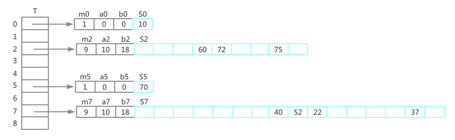
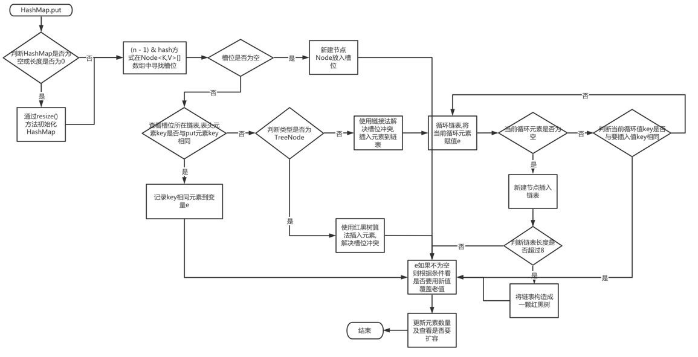

# 散列表
许多应用都需要一种动态集合结构，可以提供INSERT、SEARCH、DELETE字典操作，而散列表是实现字典操作的一种有效的数据结构。最坏情况下散列表
查找一个元素的时间与链表中查找时间相同，达到θ(n),但实际使用是新能是极好的

散列表是普通数组概念的推广，由于普通数组可以直接寻址，因此可以在O(1)时间访问数组的任意位置。如果空间允许，可以使用一个数组，为每个可能的关
键字保留一个位置，以利用直接寻址技术的优势

当实际存储的关键字数目比全部的可能关键字总数小时，采用散列表就成为直接数组寻址的一种有效替代，因为散列表使用一个长度与实际存储关键字数目成
正比的数组来存储。在散列表中不是直接把关键字作为数组下标，而是根据关键字计算出相应的下标。通过链接方法解决冲突

## 直接寻址
当关键字的全域U比较小时，直接寻址是一种简单而有效的技术，假设某应用要用到一个动态集合，其中每个元素都取自于全域U={0,1,...,m - 1}中的一个
关键字，并且没有两个元素具有相同的关键字

为表示动态数组，我们用一个数组，或称为直接寻址表，记T[0..m-1],其中每个位置（槽，slot），对应全域U中的一个关键字。如槽k指向集合中一个关键
字为key的元素，如果该集合没有关键字为key的元素，则T[k] = NIL

### 字典操作算法
```
DIRECT-ADDRESS-SEARCH(T, k)
1   return T[k]

DIRECT-ADDRESS-INSERT(T, x)
1   T[x.key] = x

DIRECT-ADDRESS-DELETE(T, x)
1   T[x.key] = NIL
```

对于某些应用，直接寻址表本身就可以存放动态集合中的元素，并不需要把每个元素的关键字及卫星数据存放在直接寻址表之外的对象中，再由直接寻址表
中的槽指向该对象。而是直接把对象存放在槽中

### 散列表
如果全域U很大，则直接寻址方式存储这样一张表不太实际，实际存储的关键字集合k相对U可能小很多，使得分配给T的大部分空间都被浪费掉

存储在字典中关键字集合k比可能的关键字全域U小很多时，散列表需要的存储空间比直接寻址表少得多。直接寻址方式下，关键字key的元素被存放在槽k中，
在散列方式下，该元素存放在槽h(k)中，通过散列函数计算出关键字key对应的槽位。函数h将关键字全域U映射到散列表T[0..m - 1]的槽位上。散列表
大小m一般比全域U小很多。通过散列函数减小散列表大小的同时，也引入了多个关键字映射到同一个槽的问题。解决冲突的方式可以使用链接法或开放寻址法处理

#### 通过链接法解决冲突
在链接法中，把散列在同一个槽中的元素都放在一个链表中，例如槽j中有一个指针，指向存储所有散列到j的元素的链表的表头,如果不存在这样的元素，则槽
j中为NIL

采用链接法解决冲突后，散列表操作如下
```
CHAINED-HASH-INSERT(T, x)
1   insert x at the head of list T[h(x.key)]

CHAINED-HASH-SEARCH(T, k)
1   search for an element with key k in list 

CHAINED-HASH-DELETE(T, x)
1   delete x from the list T[h(x.key)]
```
插入操作最坏运行时间为O(1)，我们也可以在插入前进行搜索看是否已经存在待插入数据。查找操作的最坏运行时间与表的长度成正比。如果散列表中的链
表是双向链表，则删除一个元素x的操作可以在O(1)时间完成。如果表是单链接，则为了删除元素x，需要在表T(h(x.key))中找到元素x，然后通过更改x前
驱元素的next属性，把x从链表中删除。在单链表情况下，删除和查找操作的渐近运行时间相同。建议如果要支持删除元素采用双向链接

#### 链接法散列分析
给定一个能存放n个元素、具有m个槽位的散列表T，定义T的装载因子α为n/m，即一个链的平均存储元素。用链接法散列的最坏情况性能很差：所有n个关键字
都散列到同一个槽中，从而产生出一个长度为n的链表。最坏情况下查找时间为θ(n)，再加上计算散列函数的时间，这样就和一个链表来链接所有元素差不多。
并不是说散列表的最坏情况很差就不使用

散列方法的平均性能依赖于所选取的散列函数h，将所有的关键字集合分布在m个槽位上的均匀程度。假设任何一个给定元素等可能地散列到m个槽中的任何一个，
且与其他元素被散列到什么位置无关。这个假设称为"简单均匀散列"

对于j=0,1,...,m-1，列表T[j]的长度用n<sub>j</sub>,则有

n = n<sub>0</sub> + n<sub>1</sub> + ... + n<sub>m-1</sub>

并且n<sub>j</sub>的期望值为E[n<sub>j</sub>] = α = n / m

假设可以在O(1)时间内计算出散列值h(k),查找关键字k的元素时间线性依赖与T[h(k)]的长度n<sub>h(k)</sub>.查找关键字k的元素算法分为两种情况，
第一种情况，查找不成功，没有一个元素的关键字为k；第二种情况，成功查找到关键字为k的元素

在简单均匀散列的假设下，使用链接法解决冲突的散列表，一次不成功查找平均时间为θ(1 + α)

在简单均匀散列的假设下，对于用链接法解决冲突的散列表。一次成功查找平均时间为θ(1 + α)

如果散列表中槽数至少与表中元素成正比，则有n=O(m),从而α=n/m=O(m)/m=O(1)。所以查找操作需要常量时间，当链表采用双向链接时，插入操作最坏情况
下需要O(1)，删除操作最坏情况也需要O(1)

## 散列函数

### 好的散列函数的特点
一个好的散列函数应满足简单均匀散列假设：每个关键字都等可能的散列到m个槽位中的任何一个，并与其他关键字已散列到哪个槽位无关。但一般无法检查
这一条件是否成立，因为很少能知道关键字散列所满足的概率分布，并且各关键字可能并不是完全独立的

### 除法散列法
在用来设计散列函数的除法散列法中，通过取k除以m的余数，将关键字k映射到m个槽位中的某个上，即散列函数为

    h(k) = k mod m

一个不太接近2的整数幂的素数，通常是m的一个比较好的选择。假设我们要分配一张散列表并用链接法解决冲突，表中大约存放n=2000个字符串，每个字符串有
8位，如果不介意每次不成功查找需要平均检查3个元素，这样分配散列表的大小位m=701，之所以选择701是因为，它是一个接近2000/3但又不接近2的任何次
幂的素数。则散列函数为: h(k) = k mod 701

### 乘法散列法
散列函数的乘法散列法包含两个步骤

- 第一步，用关键字k乘常数A(0<A<1),提取kA的小数部分

- 第二步，用m乘以上步提取的小数部分，并向下取整
  
由上两步可知散列函数为：
    
    h(k) = $\lfloor m(kA mod 1) \rfloor$

这里"kA mod 1"是取kA小数部分，即kA - $\lfloor kA \rfloor$

乘法散列法的一个优点是对m的选择不是很关键，一般选择为2的某个幂次，这是因为我们可以在大多数计算机上，按下面所示方法较为容易地实现散列函数。
假设某计算机的字长为w位，k正好可用一个单字表示。限制A为形如s/2^w的一个分数，其中s是一个取自0<s<2^w的整数。先用w位整数s=A.2^w乘上k，其结果
是一个2w位的值r<sub>1</sub>2^w + r<sub>0</sub>,这里r<sub>1</sub>为乘积的高位字，r<sub>0</sub>为乘积的低位字。所求的p位散列中，包含
了r<sub>0</sub>的p个最高有效位

这个方法对任何的A值都适用，但对某些值效果更好。最佳的选择与待散列的数据特征有关

    A ≈ （$\sqrt{5}$ - 1）/ 2 = 0.618 033 988 7...

是一个比较理想的值

假设k=123456, p=14, m=2^14=16 384, w=32.依据上面建议A为形如s/2^32的分数，与（$\sqrt{5}$ - 1）/ 2最为接近，于是A=2654 435 769/2^32.
则k*s=327706022297664=(76300*2^32) + 17612864,从而有r1=76300和r0=17612864.r0的14个最高有效位产生了散列值h(k)=67

### 全域散列法
任何一个特定的散列函数，在最坏的情况下可能将所有关键字散列到同一个槽中，使平均检索时间变为θ(n).一种有效的改进方法是每次随机选择使用那种散列
函数，这种方法被称为`全域散列`。不管什么样的关键字，平均性能都会很好

全域散列法在执行时，随机从一组精心设计的函数中，选择一个作为散列函数。随机化保证没有哪一种输入会始终导致最坏情况性能。假设H为一组有限散列
函数，它将给定的关键字全域U映射到{0, 1, ..., m - 1}中，这样的函数组称为`全域的`，如果对每一对不同的关键字k, l ∈ U，满足h(k) = h(l)的
散列函数h ∈ H的个数至多为| H |/m.也就是如果从H中随机选择一个散列函数，当关键字k != l时，两者发生冲突的概率不大于1/m

如果h选自一组全域散列函数，将n个关键字散列到一个大小为m的表T中，并用链接法解决冲突，如果关键字k不在表中，则k被散列至其中的链表的期望长度
E[n<sub>h(k)</sub>]至多为α = n/m。如果关键字k在表中，则包含关键字k的链表的期望长度E[n<sub>h(k)</sub>]至多为1 + α

上述期望值与散列函数的选择有关，且不依赖于任何有关关键字分布的假设。对于每对不同的关键字k和l，定义指示器随机变量X<sub>kl</sub> = I{h(k) = h(l)}.
因为由全域散列函数的定义，一对关键字发生冲突的概率最多1/m，即Pr{h(k) = h(l)} <= 1/m

对于一个具有m个槽位且初始时为空的表，利用全域散列发和链接法解决冲突，需要θ(n)的期望时间来处理任何包含n个INSERT、SEARCH和DELETE的操作序列，
其中该序列包含了O(m)个INSERT操作

### 设计一个全域散列函数类
首先选择一个足够大的素数p，使得每个可能的关键字k都落在0到p-1的范围内，设Z<sub>p</sub>表示集合{0, 1, ..., p - 1},Z<sub>p</sub>*表示
集合{1, 2, ..., p - 1},假定关键字全域的大小大于散列表中的槽数，即p>m

对于任何a ∈ Z<sub>p</sub>*和任何b ∈ Z<sub>p</sub>，定义散列函数h<sub>ab</sub>.利用一次线性变换再进行模p和模m的规约，有

    h<sub>ab</sub>=((ak + b)mod p)mod m

例，如果p=17和m=6,则有h<sub>3,4(8)</sub>=5.所有这样的散列函数构造成的函数簇为

    H<sub>pm</sub>={h<sub>ab</sub>: a ∈ Z<sub>p</sub>*, b ∈ Z<sub>p</sub>}

每一个散列函数h<sub>ab</sub>都将Z<sub>p</sub>映射到Z<sub>m</sub>。这一类散列函数具有一个良好的性质，即输出范围的大小m是任意的，不必是
一个素数。由于对a来说有p-1种选择，对b来说有p种选择，故H<sub>pm</sub>中包含p(p-1)个散列函数

对于以上两个散列函数簇H<sub>pm</sub>是全域的

## 开放寻址法
开放寻址法中，所有元素存放在散列表中，即每个表项或包含动态集合的一个元素，或包含NIL。当查找某个元素时，要系统地检查所有的表项，直到找到所需
的元素，或最终查明该元素不在表中。在开放寻址法中，散列表可能被填满，以至于不能再插入元素。导致装载因子α绝对不会超过1

开放寻址法的好处在于不用指针，直接计算出要存取的槽序列，不用存储指针而节省的空间，使得可以用同样的空间提供更多的槽，潜在减少了冲突，提高了
检索速度。

为了使用开放寻址法插入一个元素，需要连续地检查散列表，直到找到一个空槽来放置待插入的关键字为止。检查的顺序不一定是0，1，...，m-1，而是依赖
待插入的关键字。为了确定探查那些槽，我们将散列函数加以扩充，使之包含探查号（从0开始）以作为其第二次输入参数。则散列函数如下

    h:U * {0, 1, ..., m - 1} -> {0, 1, ..., m - 1}

对每一个关键字k，使用开放寻址法的探查序列

    <h(k, 0), h(k, 1), ..., h(k, m - 1)>

是<0，1，...，m - 1>的一个排列，使得当散列表逐渐填满时，每个表位最终都可以被考虑为用来插入新关键字的槽。假设散列表T中的元素为无卫星数据的
关键字，关键字k等同于包含关键字k的元素。每个槽或包含一个关键字，或包含NIL。HASH-INSERT过程以一个散列表T和一个关键字k为输入，其要么返回关
键字k的存储槽位，要么因为散列表已满而返回错误标志
```
HASH-INSERT(T, k)
1   i = 0
2   repeat
3       j = h(k, i)
4       if T[j] == NIL
5           T[j] = k
6           return j
7       else i = i+1
8   until i == m
9   error "hash table overflow"
```

查找关键字k的算法的探查序列与将k插入时的算法一样。查找过程过程中碰到一个空巢时，查找算法就停止，因为如果k在表中，它就应该在此处，不会在探查
序列之后的位置（前提条件是关键字不会从散列表中删除）。HASH-SEARCH的输入为一个散列表T和一个关键字k，如果槽j中包含关键字k，则返回j；如果表
T中没有k，则返回NIL
```
HASH-SEARCH(T, k)
1   i = 0
2   repeat
3       j = h(k, i)
4       if T[j] == k
5           return j
6       i = i + 1
7   until T[j] == NIL or i == m
8   return NIL
```

开放寻址法的散列表中删除操作元素比较困难。当我们从槽i中删除关键字时，不能仅将其值设置为NIL。否则会导致槽i之后的元素无法被搜索到。有一个解决
办法就是将删除的槽位打上DELETED标记，并且修改HASH-INSERT方法，将标记为DELETED的槽位看做空槽，可以插入元素。这样中解决方案将导致我们操找
事件不再依赖于装载因子α。在必须删除关键字的应用中，更常用方法是采用链接法来解决冲突

做一个均匀散列的假设：每个关键字的探查序列等可能地为<0, 1, ..., m-1>的m!种排列中的任何一种。真正的均匀散列是难以实现的，常常采用一些类似的
方法。有三种方法来计算开放寻址法中的探查序列：线性探查、二次探查和双重探查。以上三种技术能保证对每个关键字k，<h(k, 0), h(k, 1), ..., h(k, m - 1)>
都是<0, 1, ..., m-1>的一个排列。这些方法均不能满足均匀散列的假设，因为它们产生的不同探查序列数都不超过m<sup>2</sup>个，在三种方法中双重
探查产生的序列数最多

### 线性探索
给定一个普通的散列函数h': U -> {0, 1, ..., m - 1},称之为辅助散列函数，线性探查方法采用的散列函数为

    h(k, i) = (h'(k) + i) mod m,  i = 0, 1, ..., m - 1

给定一个关键字k，首先探查槽T[h'(k)],即由辅助函数给出的槽位。再探查槽T[h'(k) + 1],直至槽T[m - 1].初始探查位置决定整个序列，故只有m种不同
的探查序列

线性探查方法容易实现，但也会引入"一次群集"问题。随着连续被占用的槽不断增加，平均查找时间也随之不断增加。群集现象很容易出现，因为当一个空槽
前有i个满的槽时，该空槽为下一个将被占用的概率是(i + 1)/m。连续被占用的槽会变得越来越长，平均查找时间也会变的越来越长。

### 二次探查
二次探查采用如下形式的散列函数: h(k, i) = (h'(k) + c<sub>1</sub>i + c<sub>2</sub>i<sup>2</sup>) mod m。其中h'是一个辅助散列函数，
c<sub>1</sub>和c<sub>2</sub>为正的辅助常数，i=0, 1, ..., m - 1。初始探查位置为T[h'(k)],  后续探查位置加上一个二次方程的偏移量，依赖
于探查序列号i。这种探查方法的效果比线性探查好很多，但为充分利用散列表,c<sub>1</sub>、c<sub>2</sub>和m的值要受到限制。如果两个关键字的初始
探查位置相同，那么它们的探查序列也是相同的，这是因为h'(k1, 0) = h(k2, 0)，意味着h(k1, i) = h(k2, i)。这一性质可能导致一种轻度的群集，
称为二次群集，像线程探查中一样，初始探查位置决定了整个序列，这样也仅有m个不同的探查序列被用到

### 双重散列
双重散列是用于开放寻址法的最好方法之一，因为产生的排列具有随机选择排列的许多特性。双重散列采用如下形式的散列函数：
h(k, i) = (h<sub>1</sub>(k) + ih<sub>2</sub>(k)) mod m。其中h<sub>1</sub>和h<sub>2</sub>均为辅助散列函数。初始探查位置为T[h<sub>1</sub>(k)],
后续探查位置是前一个位置加上偏移量h<sub>2</sub>(k)模m。与线性探查或二次探查不同，这里的探查序列以两种不同方式依赖于关键字k，因为初始探查
位置、偏移量或二者都可能发生变化

为了能查找整个散列表，值h<sub>2</sub>(k)必须要与表的大小m互素。有一种简便的方法确保这个条件成立，就是去m为2的幂，并设计一个总产生奇数的h<sub>2</sub>。
另一个方法是取m为素数，并设计一个总是返回较m小的正整数的函数h<sub>2</sub>.例，我们可以取m为素数，并取: h<sub>1</sub>(k) = k mod m, h<sub>2</sub>(k) = 1 + (k mod 
m')。其中m'略小于m。假设k = 123456, m = 701, m' = 700,则h<sub>1</sub>(k) = 80, h<sub>2</sub>(k) = 257,我们第一个探查位置为80，然后
检查每257个槽，直到找到该关键字，或遍历了所有槽

当m为素数或者2的幂时，双重散列法中用到了θ(m<sup>2</sup>)种探查序列，而线性探查或二次探查用了θ(m)种，前者是后两种方法的改进。因为每一对
可能的(h<sub>1</sub>(k), h<sub>2</sub>(k))都会产生一个不同的探查序列。对于m的每一种可能取值，双重散列的性能看起来都非常接近于均匀散列的
性能

### 开发寻址散列分析
开放寻址法的分析也是以散列表的装载因子α = n / m来表达的，使用开放寻址法，每个槽位至多有一个元素，n <= m，α <= 1

假设采用均匀散列，用于插入或查找每一个关键字k的探查序列<h(k, 0), h(k, 1), ..., h(k, m - 1)>等可能地为<0, 1, ..., m - 1>的任意一种排列。

给定一个装载因子为α = n / m < 1的开放寻址散列表，并假设是均匀散列的，对于一次不成功的查找，其期望的探查次数至多为1/(1-α)

假设采用均匀散列，平均情况下，向一个装载因子为α的开发寻址散列表中插入一个元素至多需要1/(1-α)次探查

假设采用均匀散列，且表中的每个关键字被查找的可能性是相同的，对于一个装载因子为α<1的开发寻址散列表，一次成功查找中的探查期望数至多为${1 \over α}$ln${1 \over 1 - α}$

## 全域散列
使用散列技术通常是个好的选择，不仅因为其有优异的平均情况性能，而且当关键字集合是静态时，散列技术也能提供出色的最坏情况性能。所说的静态指一旦
各关键字存入表中，关键字集合就不再变化了

我们采用两级的散列方法来设计完全散列方案，在每级上都使用全域散列



利用完全散列技术来存储关键字集合K={10, 22, 37, 40, 52, 60, 70, 72, 75}.外层散列函数为h(k) = ((ak + b) mod p) mod m。a = 3, b = 42,
p = 101, m = 9。例h(75) = 2,因此关键字75散列到表T的槽2中。二级散列表Sj中存储了所有散列到槽j中的关键字。Sj的大小为mj = n<sub>j</sub><sup>2</sup>,
并且相关的散列函数为h<sub>j</sub>(k) = ((a<sbu>j</sub>*k + b<sub>j</sub>) mod p) mod m<sub>j</sub>。h<sub>2</sub>(75) = 7,因此
关键字75被存储在二级散列表S2的槽7中。二级散列表没有冲突因此，因此查找时间为常数

第一级与带链接的散列表基本是一样：利用从某一全域散列簇中选出的一个散列函数h，将n个关键字散列到m个槽

第二级使用一个较小的二次散列表Sj及散列函数h<sub>j</sub>,而不是将散列到槽j中的所有关键字建立一个链表。利用精心选择的散列函数h<sub>j<sub>，
确保第二级不出现冲突

为了让第二级上不出现冲突，需要让散列表Sj的大小mj为散列到槽j中的关键字nj的平方。mj对nj的这种二次依赖可能使总体存储需求很大，但通过合理的选择
第一级散列函数，可以将预期的总体存储空间限制为O(n)

如果从一个全域散列函数类中随机选出散列函数h，将n个关键字存储在一个大小为m=n<sub>2</sub>的散列表中，那么表中出现冲突的概率小于1/2

在上述情形中m=n<sup>2</sup>,对于一个从H中随机选出的散列函数h，较有可能不发生冲突。给定待散列的包含n个关键字的集合K，K是静态的，只需几次
随机尝试，就能比较容易的找到一个没有冲突的散列函数h

当n比较大时，一个大小为m=n<sup>2</sup>的散列表还是很大，为此我们采用两级散列方法，对每个槽中的关键字仅进行一次散列，外层的散列函数h用于
将各个关键字散列到m=n个槽中。如果有n<sub>j</sub>个关键字散列到了槽j中，可以用一个大小为m<sub>j</sub>=n<sub>j</sub><sup>2</sup>的
二级散列表S<sub>j<sub>来提供无冲突的常数时间查找

如果从某一个全域散列函数类中随机选出散列函数h，用它将n个关键字存储到一个大小为m=n的散列表中，则有E[$\sum_{j=0}^{m-1}{n^2}$]<2n,n<sub>j</sub>
为散列到槽j中的关键字数

如果从某一全域散列函数类中随机选出散列函数h，用它将n个关键字存储到一个大小为m=n的散列表中，并将每个二次散列表的大小设置为m<sub>j</sub>=n<sub>j</sub><sup>2</sup>
(j = 0, 1, ..., m - 1),则在一个完全散列方案中，存储所有二次散列表所需的存储总量的期望值小于2n

如果从某一全域散列函数类中随机选出散列函数h，用函数h将n个关键字存储到一个大小为m=n的散列表中，并将每个二次散列表的大小设置为m<sub>j</sub>=n<sub>j</sub><sup>2</sup>
(j = 0, 1, ..., m - 1)，则用于存储所有二级散列表的存储总量等于或大于4n的概率小于1/2

## JDK 8中HashMap散列表实现分析
HashMap通过数组和链表的方式实现对象到散列表的存储，一级散列是一个Node<K,V>[]的数组，二级散列为Node的链表，二级散列通过链接法解决冲突。
HashMap具体源码结构如下
```
/* ---------------- Fields -------------- */

/**
 * The table, initialized on first use, and resized as
 * necessary. When allocated, length is always a power of two.
 * (We also tolerate length zero in some operations to allow
 * bootstrapping mechanics that are currently not needed.)
 */
transient Node<K,V>[] table;

/**
 * Holds cached entrySet(). Note that AbstractMap fields are used
 * for keySet() and values().
 */
transient Set<Map.Entry<K,V>> entrySet;

/**
 * The number of key-value mappings contained in this map.
 */
transient int size;

/**
 * The number of times this HashMap has been structurally modified
 * Structural modifications are those that change the number of mappings in
 * the HashMap or otherwise modify its internal structure (e.g.,
 * rehash).  This field is used to make iterators on Collection-views of
 * the HashMap fail-fast.  (See ConcurrentModificationException).
 */
transient int modCount;

/**
 * The next size value at which to resize (capacity * load factor).
 *
 * @serial
 */
// (The javadoc description is true upon serialization.
// Additionally, if the table array has not been allocated, this
// field holds the initial array capacity, or zero signifying
// DEFAULT_INITIAL_CAPACITY.)
int threshold;

/**
 * The load factor for the hash table.
 *
 * @serial
 */
final float loadFactor;

// 链表结构如下
static class Node<K,V> implements Map.Entry<K,V> {
    final int hash;
    final K key;
    V value;
    Node<K,V> next;

    Node(int hash, K key, V value, Node<K,V> next) {
        this.hash = hash;
        this.key = key;
        this.value = value;
        this.next = next;
    }

    public final K getKey()        { return key; }
    public final V getValue()      { return value; }
    public final String toString() { return key + "=" + value; }

    public final int hashCode() {
        return Objects.hashCode(key) ^ Objects.hashCode(value);
    }

    public final V setValue(V newValue) {
        V oldValue = value;
        value = newValue;
        return oldValue;
    }

    public final boolean equals(Object o) {
        if (o == this)
            return true;
        if (o instanceof Map.Entry) {
            Map.Entry<?,?> e = (Map.Entry<?,?>)o;
            if (Objects.equals(key, e.getKey()) &&
                Objects.equals(value, e.getValue()))
                return true;
        }
        return false;
    }
}
```

### 插入对象到散列


HashMap使用put(K key, V value)方法插入数据，如果初始HashMap中table属性为空或长度为0，会通过resize()方法初始化HashMap，查找一级散列
到槽位的函数为h = (n - 1) & hash. n为table属性的长度，hash为key的hash值。通过散列函数h获取对应槽位的链表，如果链表为空，则将当前插入
数据构建链表放入槽位；如果槽位对应链表不为空，则遍历链表找到空位插入当前待插入数据构建的链表。如果链表长度超过8则将链表转为红黑树
```
public V put(K key, V value) {
    return putVal(hash(key), key, value, false, true);
}

final V putVal(int hash, K key, V value, boolean onlyIfAbsent,
               boolean evict) {
    Node<K,V>[] tab; Node<K,V> p; int n, i;
    if ((tab = table) == null || (n = tab.length) == 0)
        n = (tab = resize()).length;
    if ((p = tab[i = (n - 1) & hash]) == null)
        tab[i] = newNode(hash, key, value, null);
    else {
        Node<K,V> e; K k;
        if (p.hash == hash &&
            ((k = p.key) == key || (key != null && key.equals(k))))
            e = p;
        else if (p instanceof TreeNode)
            e = ((TreeNode<K,V>)p).putTreeVal(this, tab, hash, key, value);
        else {
            for (int binCount = 0; ; ++binCount) {
                if ((e = p.next) == null) {
                    p.next = newNode(hash, key, value, null);
                    if (binCount >= TREEIFY_THRESHOLD - 1) // -1 for 1st
                        treeifyBin(tab, hash);
                    break;
                }
                if (e.hash == hash &&
                    ((k = e.key) == key || (key != null && key.equals(k))))
                    break;
                p = e;
            }
        }
        if (e != null) { // existing mapping for key
            V oldValue = e.value;
            if (!onlyIfAbsent || oldValue == null)
                e.value = value;
            afterNodeAccess(e);
            return oldValue;
        }
    }
    ++modCount;
    if (++size > threshold)
        resize();
    afterNodeInsertion(evict);
    return null;
}
```


