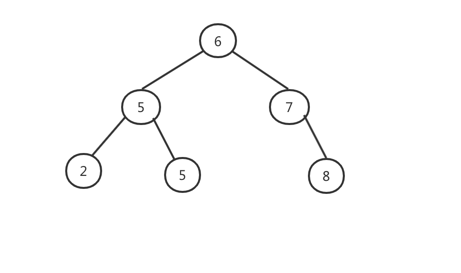
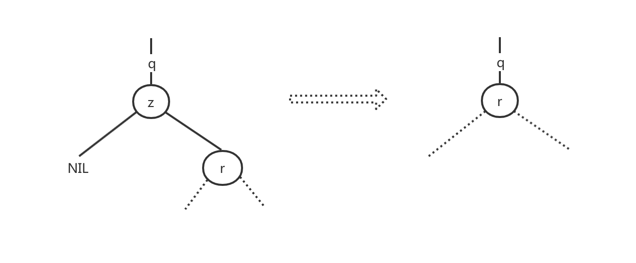
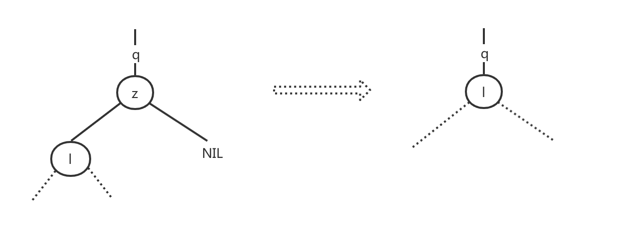
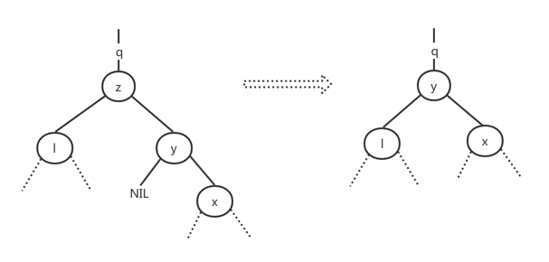
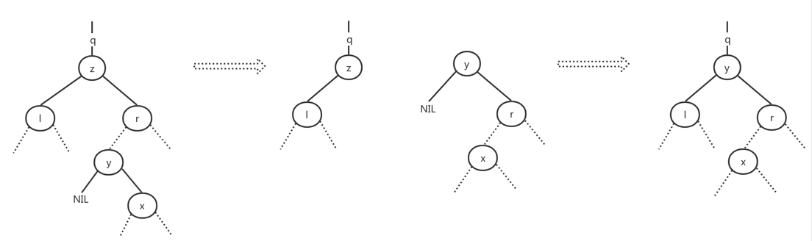

# 二叉搜索树
搜索树结构支撑许多动态集合操作，包括SEARCH、MINIMUM、MAXIMUM、PREDECESSOR、SUCCESSOR、INSERT和DELETE等。使用一颗搜索数既可以作为一个字典
又可以作为一个优先队列

二叉搜索树的基本操作所花费时间与这颗树的高度成正比。对于有n个节点的完全二叉树来说，操作的最坏运行时间为θ(lgn)。但如果这颗树是一条包含n个
节点的链表，那操作的最坏运行时间为θ(n)

## 简介
二叉搜索树是以一个二叉树构建的搜索树。可以使用一条链表数据结构来表示，其中每个节点就是一个对象。除key和卫星数据外，每个节点还包含属性left、
right和p,他们分别指向节点的左孩子、右孩子和双亲。如果某个孩子节点或父节点不存在，则相应属性值为NIL



二叉搜索树的关键字总是以满足二叉搜索树性质的方式存储：

    设x是二叉搜索树中的一个节点。如果y是x的左子树中的一个节点，那么y.key <= x.key。如果y是x的右子树中的一个节点，那么y.key >= x.key

二叉搜索树性质允许通过一个简单的递归算法来按序输出所有的关键字，这种算法称为中序遍历算法。中序遍历输出的子树根的关键子位于其左子树关键字
值和右子树关键字值之间。类似先序遍历输出的根的关键字在其左右子树的关键字值之前；后序遍历输出的根的关键字在其左右子树的关键字值之后。过程
INORDER-TREE-WALK可以输出一颗二叉搜索树T中所有的元素
```
INORDER-TREE-WALK(x)
1   if x != NIL
2   INORDER-TREE-WALK(x.left)
3   print x.key
4   INORDER-TREE-WALK(x.right)
```

如果x是一颗有n个节点子树的根，调用INORDER-TREE-WALK(x)需要θ(n)时间

## 查询二叉搜索树

### 查找指定对象
在一颗二叉搜索树中查找具有给定关键字的节点，输入一个指向树根的指针和一个关键字k，如果这个节点存在，TREE-SEARCH返会一个指向关键字为k的节点
指针，否则返回NIL
```
TREE-SEARCH
1   if x == NIL or k == x.key
2       return x
3   if k < x.key
4       return TREE-SEARCH(x.left, k)
5   else return TREE-SEARCH(x.right, k)
```

从树根开始查找，并沿着这颗树中的一条简单路径向下进行，对遇到的每个节点，比较关键字k与x.key。如果两个关键字相等，查找终止，返回结果。如果k
小于x.key,查找在x的左子树中继续；如果k大于x.key,查找在右子树中。从树根开始递归期间遇到的节点就形成了一条向下的简单路径，所以TREE-SEARCH
的运行时间为O(h),h为树的高度

也可以使用while循环展开递归
```
ITERATIVE-TREE-SEARCH(x,  k)
1   while x != NIL and k != x.key
2       if k < x.key
3           x = x.left
4       else x = x.right
5   return x
```

### 最大关键字元素和最小关键字元素
通过从树根开始沿着left孩子指针直到遇到一个NIL，便找到了最小关键字元素
```
TREE-MINIMUM(x)
1   while x.left != NIL
2       x = x.left
3   return x
```

通过从树根开始沿着right孩子指针直到遇到一个NIL，便找到了最大关键字元素
```
TREE-MAXIMUM(x)
1   while x.right != NIL
2       x = x.right
3   return x
```

以上查找最小、最大关键子元素均能在O(h)内执行完成，h为树高。与查找指定对象方法一样，所经过的节点形成了一条从树根向下的简单路径

### 后续和前驱
给定二叉搜索树的一个节点，按中序遍历的次序查找其后续，如果所有关键字都不相同，则一个节点x的后续是大于x.key的最小关键字的节点。一颗二叉搜索
树的结构允许我们通过没有任何关键字的比较来确定一个节点的后续。方法TREE-SUCCESSOR(x)为查找后续的算法
```
TREE-SUCCESSOR(x)
1   if x.right != NIL
2       return TREE-MINIMUM(x.right)
3   y = x.p
4   while y != NIL and x == y.right
5       x = y
6       y = y.p
7   return y
```

上述算法分为两种情况，第一种情况，x的右子树不为空，x的后续是x的右子树的最左节点。第二种情况，如果x右子树为空，那么x的后续y，是x的最底层祖先，
并且y的左孩子也是x的一个祖先。在一颗高度为h的树上，TREE-SUCCESSOR的运行时间为O(h),因为该过程或者遵循一条简单路径向上或者尊从简单路径向下。
方法TREE-PREDECESSOR与TREE-SUCCESSOR是对称的，运行时间也是O(h)

即使关键字非全不相同，仍然定义任何节点的后续和前驱分别为调用TREE-SUCCESSOR(x)和TREE-PREDECESSOR(x)所返回节点

## 插入和删除

### 插入
要将一个新值v插入到一颗二叉搜索树T中，需要调用过程TREE-INSERT.该过程以节点z作为输入，z.key = v，z.left = NIL, z.right=NIL,插入过程
需要修改T和z的某些属性，把z插入到树中的相应位置上
```
TREE-INSERT(T, z)
1   y = NIL
2   x = T.root
3   while x != NIL
4       y = x
5       if z.key < x.key
6           x = x.left
7       else x = x.right
8   z.p = y
9   if y == NIL
10      T.root = z
11  elseif z.key < y.key
12      y.left = z
13  else y.right = z
```

TREE-INSERT方法从树根开始，指针x记录一条向下的简单路径，并查找要替换的输入项z的NIL。该过程保持遍历指针y作为x的双亲，while循环使两个指针沿
树向下移动，向左或向右移动取决于z.key和x.key的比较，直至x变为NIL，这个NIL则为输入z要放置的位置。y则为输入z的双亲节点，根据z.key和y.key
的比较决定是放y的左边还是右边，当y为NIL时直接设置z为根节点

### 删除
从一颗二叉搜索树T中删除一个节点z分为三种情况

- 如果z没有孩子节点，直接删除z，并修改父节点，设置孩子节点为NIL替换z

- 如果z只有一个孩子，将这个孩子提升到树中z的位置上，并修改z的父节点，用z的孩子来替换z

- 如果z有两个孩子，找z的后续y，y一定在z的右子树中，并让y占据树中z的位置，z的原来右子树部分成为y的新右子树，并且z的左子树成为y的新左子树

从一颗二叉搜索树中删除节点z，取指向T和z的指针作为输入

- 如果z没有左孩子，那么用右孩子替换z，当右孩子为NIL，则是z没有孩子节点的情况；当右孩子不为NIL，则是z只有一个孩子节点的情况



- 如果z仅有一个孩子且为左孩子，那么用其左孩子来替换z



- z既有一个左孩子又有一个右孩子，则需要查找z的后续y，这个后续在z的右子树中并且没有左孩子。将y移出原来位置进行拼接，替换z的位置

- 如果上步中得到的y是z的右孩子，则用y替换z，并仅留下y的右孩子



- 如果上步中得到的y是z右子树中的一个节点，但并非右孩子，则先用y的右孩子替换y，然后再用y替换z



为在二叉搜索树内移动子树，定义一个过程TRANSPLANT，用另一颗子树替换一颗子树并成为其双亲的孩子节点。当TRANSPLANT用一颗以v为根的子树来替换
一颗以u为根的子树时，节点u的双亲就变为节点v的双亲，并且最后v成为u的双亲的相应孩子
```
TRANSPLANT(T, u, v)
1   if u.p == NIL
2       T.root = v
3   elseif u == u.p.left
4       u.p.left = v
5   else u.p.right = v
6   if v != NIL
7       v.p = u.p
```

从二叉搜索树T中删除删除节点z的删除过程如下
```
TREE-DELETE(T, z)
1   if z.left == NIL
2       TRANSPLANT(T, z, z.right)
3   elseif z.right == NIL
4       TRANSPLANT(T, z, z.left)
5   else y = TREE-MINIMUM(z.right)
6       if y.p != z
7           TRANSPLANT(T, y, y.right)
8           y.right = z.right
9           y.right.p = y
10      TRANSPLANT(T, z, y)
11      y.left = z.left
12      y.left.p = y
```