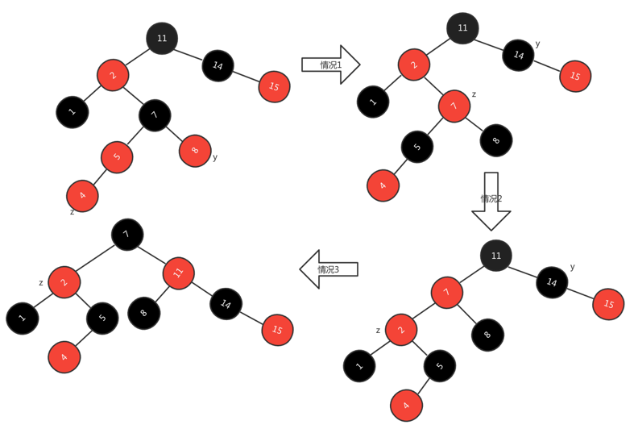

# 红黑树
我们看到二叉搜索树在动态集合操作时，其时间复杂度均为O(h),在搜索树高度较低时，有不错的性能，但如果树的高度较高时，这些集合操作并不比在链表
上快。红黑树是平衡搜索树中的一种，可以保证在最坏情况下动态集合操作的时间复杂度为O(lgn)

## 红黑树的性质
红黑树是一颗二叉搜锁树，在每个节点上增加一个存储位来表示节点的颜色，可以是RED或BLACK。通过对任何一条从根到叶子的简单路径上各个节点的颜色
进行约束，确保没有一条路径会比其它路径长出2倍，近似于平衡

树中每个节点包含5个属性：color、key、left、right和p。如果一个节点没有子节点或父节点，则该节点相应属性的值为NIL。一颗红黑树是满足如下红黑
性质的二叉搜索树

- 每个节点只能是红色或黑色中的一种

- 根节点是黑色

- 每个叶节点（NIL）是黑色

- 如果一个节点是红色的，它的两个孩子节点都是黑色

- 每个节点，从该节点到其所有后代叶节点的简单路径上，均包含相同数量的黑色节点

为便于处理红黑树中边界条件，使用一个哨兵来代表NIL。对于红黑树T，哨兵T.nil是一个与树中普通节点有相同属性的对象，color属性为BLANCK。使用
哨兵节点后，可以将节点x的NIL孩子视为一个普通节点，x为其父节点。我们可以为树内的每个NIL新增一个不同的哨兵节点，使每个父节点都有比较好的定义，
但这样会浪费空间。另一种方式是使用一个哨兵T.nil来代表所有的NIL：所有的叶节点和根节点的父节点。

我们将注意力放在红黑树的内部节点上，因为他们存储了关键子的值。从某个节点x出发，不包含该节点，到达一个叶节点的任意一条简单路径上黑节点的个数
称为该节点的黑高，记为bh(x).根据性质5，黑高的性质为每个节点到其叶节点的简单路径上黑色节点的个数都相同，于是定义红黑树的黑高为其根节点的黑高

***引理：一颗有n个内部节点的红黑树的高度至多为2lg(n+1)***

由上述引理可知，动态集合操作SEARCH、MINIMUM、MAXIMUM、SUCCESSOR和PREDECESSOR可在红黑树上O(lgn)时间内执行，这些操作在一颗高度为h的二叉
搜索树上的运行时间为O(h),任何包含n个节点的红黑树都是高度为O(lgn)的二叉搜索树

## 旋转
搜索树操作TREE-INSERT和TREE-DELETE在含n个关键字的红黑树上，运行花费时间为O(lgn),但由于这两个操作对树做了修改，可能会使修改后的树违反红黑树
的性质，为维持这些性质，必须改变树中某些节点的颜色以及指针结构

指针结构的修改是通过旋转来完成，通过旋转可以保持二叉搜索树的性质。树的旋转分为左旋和右旋。当在某个节点x上做左旋时，假设他的右孩子是y而不是
T.nil；x可以为其右孩子不是T.nil节点的树内任意节点。左旋以x到y的链为支轴进行，它使y成为该子树新的根节点，x成为y的左孩子，y的左孩子成为x的
右孩子


二叉搜索树上的旋转操作。LEFT-ROTATE(T, x)通过改变常数数目指针，可以将右边两个结点结构转变为左边的结构。左边的结构可以使用相反的操作RIGHT-ROTATE(T, y)
来转变成右边结构，字母a、b、c代表任意子树。旋转操作保持了二叉搜索树的性质

在LEFT-ROTATE的伪代码中，假设x.right!=T.nil且根节点的父节点为T.nil
```
LEFT-ROTATE(T, x)
1   y = x.right
2   x.right = y.left
3   if y.left != T.nil
4       y.left.p = x
5   y.p = x.p
6   if x.p == T.nil
7       T.root = y
8   elseif x == x.p.left
9       x.p.left = y
10  else x.p.right = y
11  y.left = x
12  x.p = y
```

RIGHT-ROTATE操作的代码与LEFT-ROTATE对称。都在O(1)时间内完成运行。在旋转过程中只会改变指针，其他所有属性都保持不变

## 插入
可以在O(lgn)时间内完成向一颗含n个节点的红黑树中插入一个新节点。我们先按照普通二叉搜索树完成新节点z的插入操作，然后将z着为红色。为保证红黑
性质能继续保持，调用RB-INSERT-FIXUP来对节点重新着色并旋转。调用RB-INSERT(T, z)在红黑树T内完成插入新节点操作
```
RB-INSERT(T, z)
1   y = T.nil
2   x = T.root
3   while x != T.nil
4       y = x
5       if z.key < x.key
6       x = x.left
7       else x = x.right
8   z.p = y
9   if y == T.nil
10      T.root = z
11  elseif z.key < y.key
12      y.left = z
12  else y.right = z
13  z.left = T.nil
14  z.right = T.nil
15  z.color = RED
17  RB-INSERT-FIXUP(T, z)
```
以上红黑树中插入新节点的过程与二叉搜索树中插入新节点的过程存在一下4点差别

- 二叉搜索树中NIL在红黑树中使用T.nil代替

- RB-INSERT中将z.left、z.right设置为T.nil，以保持树结构

- 将z着为红色

- 将z着为红色，可能违反红黑性质，调用RB-INSERT-FIXUP(T, z)保持红黑性质

```
RB-INSERT-FIXUP(T, z)
1   while z.p.color == RED
2       if z.p == z.p.p.left
3           y = z.p.p.right
4           if y.color == RED           // 情况1
5               z.p.color = BLACK       // 情况1
6               y.color = BLACK         // 情况1
7               z.p.p.color = RED       // 情况1
8               z = z.p.p               // 情况1
9           else if z == z.p.right      // 情况2
10              z = z.p                 // 情况2
11              LEFT-ROTATE(T, z)       // 情况2
12          z.p.color = BLACK           // 情况3
13          z.p.p.color = RED           // 情况3
14          RIGHT-ROTATE(T, z.p.p)      // 情况3
15      else(same as then clause with "right" and "left" exchanged)
16  T.root.color = BLACK
```

RB-INSERT-FIXUP操作。当z节点插入后，由于z和它的父节点z.p都是红色，违反了性质4。由于z的叔节点y是红色，执行情况1。节点被重新着色，并且指针
z沿数上升。再一次z及其父节点都为红色，但z的叔节点为黑色，因为z为其父节点的右孩子，执行情况2，经过一次左旋，z变为其父节点的左孩子，应用情况3。
重新着色执行一次右旋后变为一颗合法的红黑树



在调用RB-INSERT-FIXUP操作时，性质1、性质3、性质5是可以继续保持不被破坏。但性质2和性质4可能被破坏。因为我们加入的节点z是一个红色的并且
带有黑色叶子节点的节点。但有可能只有z节点，z节点是红色的根节点，破坏性质2；也有可能z节点的父节点为红色破坏性质4

## 分析
一颗n个节点的红黑树高度为O(lgn),因此RB-INSERT的1～16行花费O(lgn)时间。RB-INSERT-FIXUP,仅当情况1发生，指针z沿树上升2层，while循环才会
重复执行。while循环可能被执行的总次数为O(lgn).因此RB-INSERT总共花费O(lgn)时间。并且旋转从不超过两次，因为执行情况2或情况3，while循环
就结束了

## 删除
在红黑树中删除一个节点需要花费O(lgn)时间。首先需要需要设计一个供RB-DELETE调用的子过程RB-TRANSPLANT
```
RB-TRANSPLANT(T, u, v)
1   if u.p == T.nil
2       T.root = v
3   elseif u == u.p.left
4       u.p.left = v
5   else u.p.right = v
6   v.p = u.p
```
RB-DELETE与TREE-DELETE类似，多出的几行代码记录节点y的踪迹，y可能导致红黑树性质的破坏。当要删除节点z，此时z的子节点少于2个时，z从树中删除，
并让y成为z。当z有两个子节点时，y应该是z的后续，并且y将移至树中的z位置。在节点被移除或在树中移动前，必须记住y的颜色，并记录节点x的踪迹，将
x移至树中y的原来位置，节点x也可能引起红黑性质的破坏。删除节点z之后，RB-DELETE调用辅助过程RB-DELETE-FIXUP,该过程改变颜色和执行旋转来恢复
红黑性质
```
RB-DELETE(T, z)
1   y =  z
2   y-original-color = y.color
3   if z.left == T.nil
4       x = z.right
5       RB-TRANSPLANT(T, z, z.right)
6   elseif z.right == T.nil
7       x = z.left
8       RB-TRANSPLANT(T, z, z.left)
9   else y = TREE-MINIMUM(z.right)
10      y.original-color = y.color
11      x = y.right
12      if y.p == z
13          x.p = y
14      else RB-TRANSPLANT(T, y, y.right)
15          y.right = z.right
16          y.right.p = y
17      RB-TRANSPLANT(T, z, y)
18      y.left = z.left 
19      y.left.p = y
20      y.color = z.color
21      if y-original-color == BLACK
22          RB-DELETE-FIXUP(T, x)
```

RB-DELETE在包含TREE-DELETE逻辑基础上，添加了其他控制逻辑，两个过程的区别如下

- 始终维持节点y为从树中删除节点或移至树内的节点。当z的子节点少于两个时，首先将y指向z，并移除。当z有两个子节点时，第9行代码将y指向z的后续，
y将移至树中z的位置
  
- 节点y的颜色可能改变，变量y-original-color存储发生改变前的y的颜色，当z有两个子节点时，y != z,节点y移至红黑树中节点z的原始位置。第20行
给y赋予和z一样的颜色，我们需要保持y的原始颜色，以在RB-DELETE结束时判断是否需要修复红黑树，当y的原始颜色是黑色时，删除或移动y会引起红黑性质的破坏
  
- 保存节点x的踪迹，使它移至节点y的原始位置上。第4、7和11行的赋值语句令x或指向y的唯一子节点或指向哨兵T.nil

- 节点x移动到节点y的原始位置，x.p设置为指向树中y的原始节点的位置。如果z不是y的原始父节点，对x.p的赋值在RB-TRANSPLANT的第6行。当y的原始
父节点为z时，我们不会将x.p设置为y的原始父节点z，因为z将被删除，节点y将在树中向上移动占据z的位置，第13行将x.p设置为y，使得x.p指向y父节点的
原始位置
  
- 如果节点y是黑色，可能会引入一个或多个红黑树性质被破坏的情况，在第22行调用RB-DELETE-FIXUP来恢复红黑树性质。如果y是红色，则删除或移动
时，红黑性质仍然保持，原因有以下三点
  
    - 树的黑高没有变化
    
    - 不存在两个相临的红节点。y在树中占据了z的位置，再考虑到z的颜色，树中y的新位置不可能有两个相邻的红节点。如果y不是z的右孩子，则y的原
  右孩子x代替y。如果y是红色，则x一定是黑色，因此用x替代y不可能使两个红节点相邻
      
    - 如果y是红色，就不可能是根节点，所以根节点依然是黑色
  
节点y如果是黑色，会产生3个问题，可以通过RB-DELETE-FIXUP进行补救

  - y如果是原本的根节点，y的一个红色的孩子成为了新的根节点则违反了红黑树性质2

  - 如果x、x.p是红色，则违反了性质4

  - 在树中移动y将导致任何包含y的简单路径上黑节点个数少1，y的任何祖先都不满足性质5。改正这一问题的办法是将占有节点y原来位置的x视为还有一
重额外的黑色。这样性质5成立，但x将不满足性质1

### 恢复搜索树的红黑性质
过程RB-DELETE-FIXUP提供恢复搜索树红黑性质功能
```
RB-DELETE-FIXUP(T, x)
1 while x != T.root and x.color == BLACK
2   if x == x.p.left
3     w = x.p.right
4     if w.color == RED
5       w.color = BLACK                                               // 情况1
6       x.p.color = RED                                               // 情况1
7       LEFT-ROTATE(T, x, p)                                          // 情况1
8       w = x.p.right                                                 // 情况1
9     if w.left.color == BLACK and w.right.color == BLACK
10      w.color = RED                                                 // 情况2
11      x = x.p                                                       // 情况2
12    else if w.right.color ==  BLACK
13      w.left.color = BLACK                                          // 情况3
14      w.color = RED                                                 // 情况3
15      RIGHT-ROTATE(T, w)                                            // 情况3
16      w = w.p.right                                                 // 情况3
17    w.color = x.p.color                                             // 情况4
18    x.p.color = BLACK                                               // 情况4
19    w.right.color = BLACK                                           // 情况4
20    LEFT-ROTATE(T, x.p)                                             // 情况4
21    x = T.root                                                      // 情况4
22  esle(same as then clause with "right" and "left" exchanged)
23 x.color = BLACK
```
将x视为还有一重额外的黑色，则将违反的性质5转换成x违反性质1。过程RB-DELETE-FIXUP将恢复性质1、性质2和性质4。第1～22行中while循环目标是将
额外的黑色沿树上移，直到：

- x指向红黑节点，此时在第23行将x着为单个黑色，去除掉额外的黑色

- x指向根节点，此时可以简单移除额外的黑色

- 执行适当的旋转和重新着色，推出循环

在while循环中，x总是指向一个具有双重黑色的非根节点，第2行中判断x是其父节点的左孩子还是右孩子，保持指针w指向x的兄弟。由于节点x是双重黑色，故
w不可能是T.nil，否则从x.p至叶子w的简单路径上的黑节点个数就会小于从x.p到x的简单路径上的黑节点数。

#### 情况1，x的兄弟节点w是红色


情况1发生在节点x的兄弟节点w为红色时，因为w必须要有黑色子节点，可以改变w和x.p的颜色，然后对x.p做一次左旋而不违反红黑树任何性质。x的新兄弟
节点是旋转之前w的某个子节点，其颜色为黑色，这样将情况1转换为情况2、3或4处理

#### 情况2，x兄弟节点w为黑色，而且w的两个子节点都是黑色


情况2，w的两个子节点都是黑色。因为w也是黑色，所以从x和w上去掉一重黑色，使得x只有一重黑色而w为红色。为补偿从x和w中去掉的一重黑色，在原来是
红色或黑色的x.p上新增一重黑色。将x.p作为新节点x来重复while循环。如果通过情况1进入情况2，则新节点x是红黑的，因为原来的x.p是红色。新节点
x的color属性值为RED，在之后的循环测试条件终止。在第23行将新节点x着色为单一黑色

#### 情况3，x的兄弟节点w是黑色，w左孩子是红色，w的右孩子是黑色


情况3发生在w为黑色且左孩子为红色、右孩子为黑色时。通过交换w和其左孩子w.left的颜色，然后对w进行右旋而不违反红黑树任何性质。现在新兄弟节点
w时一个有红色右孩子的黑色节点，我们将情况3转换成情况4

#### x的兄弟节点w是黑色，且w的右孩子是红色

 
情况4节点x的兄弟节点w为黑色且w的右孩子为红色，通过进行某些颜色修改并对x.p做一次左旋，可以去掉x的额外黑色，从而使其变为单重黑色，不破坏红黑树
的任何性质。将x设置为根后，当while循环测试其循环条件时，循环终止

#### 分析
含n个节点的红黑树高度为O(lgn)，不调用RB-DELETE-FIXUP，RB-ELETE过程的时间总代价为O(lgn)。在RB-DELETE-FIXUP中，情况1、3、4在各执行常数
次颜色改变和至多3次旋转便终止。情况2执行时指针x沿树上升至多O(lgn)次，且不执行任何旋转。因此RB-DELETE-FIXUP要花费O(lgn)时间，因此RB-DELETE
运行总时间为O(lgn)

