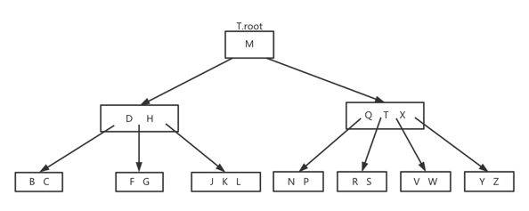

# B树
B树是为磁盘或其他直接存取辅助存储设备而设计的一种平衡搜索树。B树类似于红黑树，但B树在降低I/O操作方面更好。许多数据库系统使用B树或B树的变种
来存储信息

B树与红黑树的不同在于B树的节点可以有多个孩子，一个B树的子节点可以相当大，通常依赖于所使用的磁盘单元特性。一颗含有n个节点的B树其高度为O(lgn)。
一颗B树严格高度可能比一颗红黑树的高度小很多，因为其子节点可以有多个。我们可以使用B树在时间O(lgn)内完成一些动态集合操作



如图，B树的内部节点x包含x.n个关键字，那么节点x就有x.n+1个孩子。节点x中关键字就是分隔点，把节点x所处理的关键字的属性分隔为x.n+1个子域，每个
子域都由x的一个孩子处理。当在一颗B树中搜索某个关键字，将在x中的x.n个关键字做比较，确定一个(x.n+1)路的选择。但叶节点的结构与内部节点的结构
不同

## 辅存上的数据结构
磁存储技术（磁盘或磁带等）容量通常比主存高出两个数量级，而每位的存储代价比主存低一个数量级。由于磁盘的构成决定其比主存要慢很多，磁盘读取数据
时需要旋转磁盘和移动磁臂，这两个机械运动将占用一定时间。目前商业磁盘转速5400～15000 转/分钟（RPM），15000RPM用于服务器级的驱动，7200RPM
用于台式机上，5400RPM用于笔记本。7200RPM旋转一圈需要8.33ms，比硅存储存取50ns要高5个数量级。商用磁盘平均存取时间在8~11ms

为摊还机械运动所花费等待时间，磁盘一次读取多个数据项。信息被分为一系列相等大小的在柱面内连续出现的位页面，每个磁盘读或写一个或多个完整的页面。
一般一页的长度为2^11~2^14字节

在一个典型的B树应用中，需要处理的数据量非常大，所有数据无法一次装入主存。B树算法将所需页面从磁盘复制到主存，然后将修改过的页面写回磁盘。任何
时刻B树算法都只需要在主存中保持一定数量的页面。因此主存的大小并不限制被处理B树的大小

设x为指向一个对象的指针，如果该对象已经在内存中，则可以直接访问其属性，但如果不在，则需要先执行DISK-READ(x)操作，将对象读入主存中。操作
DISK-WRITE(x)完成对像x的属性修改保存，一个对象操作的典型模式如下：
```
    x = a pointer to some object
    DISK-READ(x)
    访问或修改x属性
    DISK-WRITE(x)
```

在大多数操作系统中，一个B树算法的运行时间主要由所执行的DISK-READ和DISK-WRITE操作次数决定，我们希望每次能够尽可能多的读取或写入数据。一个
B树节点通常和一个完整磁盘一样大，磁盘页的大小限制一个B树节点可以含有的孩子数

对存储在磁盘上一颗大的B树，通常分支因子在50～2000之间，具体取决于一个关键字相对于一页的大小。一个大的分支因子可以大大降低树的高度及查找任何一个
关键字所需的磁盘存储次数

## B树定义
任何和关键字相关联的卫星数据都将与关键字存储在同一个节点。比如B树的变种，B+树就是把所有卫星数据都存储在叶节点上，以最大化内部节点的分支因子

一颗B树T是具有以下性质的有根树（根为T.root）

- 每个节点x有下面属性

    - x.n,当前存储在节点x中的关键字个数
    
    - x.n个关键字本身x.key<sub>1</sub>, x.key<sub>2</sub>, ..., x.key<sub>x.n</sub>,以非降序存放,x.key<sub>1</sub> <= x.
      key<sub>2</sub> <= ... <= x.key<sub>x.n</sub>
      
    - x.leaf，布尔值，x为叶节点，则为TRUE；x为内部节点，则为FALSE
    
- 每个内部节点x，包含x.n + 1个指向其孩子的指针x.c<sub>1</sub>, x.c<sub>2</sub>, ..., x.c<sub>x.n+1</sub>。叶节点没有孩子，其c<sub>i</sub>
属性没有定义
  
- 关键字x.key<sub>i</sub>对存储在各个子树中的关键字范围加以分隔：如果k1为任意一个存储在以x.c<sub>i</sub>为根的子树中的关键字，则
k<sub>i</sub> <= x.key<sub>1</sub> <= k<sub>2</sub> <= x.key<sub>2</sub> <= ... <= x.key<sub>x.n</sub> <= k<sub>x.
  n+1</sub>

- 每个叶节点具有相同的深度，即树的高度h

- 每个节点所包含的关键字个数有上界和下界。用一个被称为B树的最小度数的固定整数t>=2来表示

    - 除根节点以外的每个节点必须至少有t-1个关键字，除根节点以外的每个内部节点至少有t个孩子。如果树非空，根节点至少有一个关键字

    - 每个节点至多可以包含2t-1个关键字，一个内部节点至多可有2t个孩子，当一个节点恰好有2t-1个关键字时，称该节点是满的

t=2时的B树是最简单的。每个内部结点有2、3、或4个孩子，即一颗2-3-4树。在实际中，t值越大，B树高度越小

### B树高度
B树上大多数操作所需的磁盘存取次数是与B树高度成正比

***如果n>=1,那么对任意一颗包含n个关键字、高度为h、最小度数t>=2的B树T，有h<=log<sub>t</sub>(n+1)/2***

由于B树的高度公式可知，当t变大时高度再减少，相较于红黑树的高度，B树的高度可以很低。因此B树避免了大量的磁盘访问

## B树上的基本操作
在讨论B树的基本操作前，我们约定

- B树的根节点始终在主存中，无需对根做DISK-READ操作，当根节点被改变后，需要对根节点做一次DISK-WRITE操作

- 任何当作参数传递的节点在传递之前，都需要对他们做一次DISK-READ操作

### 搜索B树
搜索B树与搜索二叉树类似，只是B树搜索时，每个节点做的不是二路分支选择，而是(x.n+1)路分支选择

B-TREE-SEARCH是定义在二叉搜索树上的TREE-SEARCH过程的一个推广。输入为指向某个子树根节点x的指针，及需要在该子树中搜索的一个关键字k。如果
k在B树中，则返回节点y和使得y.key<sub>i</sub> = k的下标i组成的有序对(y, i);否则，返回NIL
```
B-TREE-SEARCH(x, k)
1 i = 1
2 while i <= x.n and k > x.key<sub>i</sub>
3   i = i + 1
4 if i <= x.n and k == x.key<sub>i</sub>
5   return(x, i)
6 else if x.leaf
7   return NIL
8 else DISK-READ(x, c<sub>i</sub>)
9   return B-TREE-SEARCH(x.c<sub>i</sub>, k) 
```

B树搜索过程构成一条从树根向下的简单路径。在B-TREE-SEARCH过程访问的磁盘页面数为O(h) = O(log<sub>t</sub>n),h为B树的高，n为B树所含关键字
个数。由于x.n<2t，在2～3行的循环每个节点中花费的时间为O(t),总的CPU时间为O(th) = O(t*log<sub>t</sub>n)

### 创建一颗空的B树
为创建一颗B树T，先用B-TREE-CREATE来创建一个空的根节点，然后调用B-TREE-INSERT来添加新的关键字。在此过程中需要使用ALLOCATE-NODE，其在
O(1)时间内为新节点分配一个磁盘页
```
B-TREE-CREATE
1 x = ALLOCATE-NODE()
2 x.leaf = TRUE
3 x.n = 0
4 DISK-WRITE(x)
5 T.root = x
```

### 向B树中插入一个关键字
B树中插入一个关键字要比二叉搜索树中插入一个关键字复杂得多。在B树中，不能简单创建一个新的叶结点插入，这样将B树变得不合法。我们会将新的关键字
插入一个已经存在的叶结点。但我们不能将关键字插入一个满的叶结点，因此我们引入一个操作，将一个满的结点y（2t-1个关键字）按其中间关键字y.key<sub>t</sub>
分裂为两个各含t-1个关键字的结点。中间关键字被提升到y的父节点，用于标识两颗新树的划分点。如果y的父结点也是满的，则需要插入新的关键字之前将其分裂，
最终满结点的分裂会沿树向上传播

在B树中实际插入新关键字，是从根节点开始向下查找，并将查找过程中遇到的每个满结点分裂，直到插入新关键字为止

### 分裂B树中的结点
过程B-TREE-SPLIT-CHILD输入是一个非满的内部结点x和一个使x.c<sub>i</sub>为x的满子节点的下标i。此过程这个子节点分裂成两个，并调整x，使其
包含多出来的孩子。要分裂一个满的根，需要让根成为一个新的空根结点的孩子，才能使用B-TREE-SPLIT-CHILD。树的高度也因此增加1，分裂是树长高的唯一
途径

满节点y=x.c<sub>i</sub>按照其中间关键字S进行分裂，S被提升到y的父节点x，y中大于中间关键字的关键字都置于一个新的节点z中，成为x的一个新孩子
```
B-TREE-SPLIT-CHILD(x,i)
1   z = ALLOCATE-NODE()
2   y = x.c<sub>i</sub>
3   z.leaf = y.leaf
4   z.n = t - 1
5   for j = 1 to t - 1
6     z.key<sub>j</sub> = y.key<sub>j + 1</sub>
7   if not y.leaf
8     for j = 1 to t
9       z.c<sub>j</sub> = y.c<sub>j + 1</sub>
10  y.n = t - 1
11  for j = x.n + 1 downto i + 1
12  x.c<sub>j + 1</sub> = x.c<sub>j</sub>
13  x.c<sub>i + 1</sub> = z
14  for j = x.n downto i
15    x.key<sub>j + 1</sub> = x.key<sub>j</sub>
16  x.key<sub>i</sub> = y.key<sub>t</sub>
17  x.n = x.n + 1
18  DISK-WRITE(y)
19  DISK-WRITE(z)
20  DISK-WRITE(x)
```

B-TREE-SPLIT-CHILD过程中，x是被分裂的结点，y是x的第i个孩子。开始结点y有2t个孩子，2t-1个关键字，在分裂后减少至t个孩子，t-1个关键字。
结点z取走y的t个最大的孩子，t-1个关键字，并且z成为x的新孩子，它在x的孩子表中仅位于y之后。y的中间关键字上升到x中，成为分隔y和z的关键字

### 以沿树单程下行方式向B树插入关键字
在一颗高度为h的B树中，以沿树单程下行方式插入一个关键字k的操作需要O(h)次磁盘存取。所需的CPU时间为O(th)=O(tlog<sub>t</sub>n)。过程B-TREE-INSERT
利用B-TREE-SPLIT-CHILD来保证递归始终不会降至一个满结点上
```
B-TREE-INSERT(T, k)
1   r = T.root
2   if r.n == 2t - 1
3     s = ALLOCATE-NODE()
4     T.root = s
5     s.leaf = FALSE
6     s.n = 0
7     s.c1 = r
8     B-TREE-SPLIT-CHILD(s, 1)
9     B-TREE-INSERT-NONFULL(s. k)
10  else B-TREE-INSERT-NONFULL(r, k)
```

第3～9行处理根节点为满的情况，原来的根节点被分裂，一个新的节点s成为根。对根进行分裂是增加B树高度的唯一途径。与二叉搜索树不同，B树高度的增加
发生在顶部而不是底部。过程通过调用B-TREE-INSERT-NONFULL完成将关键字k插入以非满的根节点为根的树中，在需要时沿树向下递归，通过B-TREE-SPLIT-CHILD
来保证任何时刻所递归处理的节点都是非满的。辅助过程B-TREE-INSERT-NONFULL将关键字插入节点x，要求调用该过程时x是非满的
```
B-TREE-INSERT-NONFULL(x, k)
1   i = x.n
2   if x.leaf
3       while i >= 1 and k < x.key<sub>i</sub>
4          x.key<sub>i + 1</sub> = x.key<sub>i</sub>
5          i = i - 1
6       x.key<sub>i + 1</sub> = k
7       x.n = x.n + 1
8       DISK-WRITE(x)
9   else while i >= 1 and k < x.key
10        i = i -1
11      i = i + 1
12      DISK-READ(x.c<sub>i</sub>)
13      if x.c<sub>i</sub>.n == 2t - 1
14        B-TREE-SPLIT-CHILD(x, i)
15        if k > x.key<sub></sub>
16           i = i + 1
17      B-TREE-INSERT-NONFULL(x.ci, k)    
```

第3～8行处理x为叶节点情况，将关键字k插入x。如果x不是叶节点，则必须将k插入以内部节点x为根的子树中适当的叶节点中去。第9～11决定向x的哪个子节点
递归下降。第13行检查是否是递归降至满节点上。若是则第14行用B-TREE-SPLIT-CHILD将该子节点分裂为两个非满的孩子，第15～16确定向两个孩子中的
哪个下降。第17行递归将k插入合适的子树中

对一颗高度为h的B树来说，B-TREE-INSERT要做O(h)次磁盘存取，因为每次调用B-TREE-INSERT-NONFULL之间，只做O(1)次DISK-READ和DISK-WRITE操作。
所占用的总CPU时间为O(th) = O(tlog<sub>n</sub>)。因为B-TREE-INSERT-NONFULL是尾递归，所以也可以用while循环实现。在任何时刻需要留在主存
中的页面数为O(1)

## 从B树中删除关键字
相较于B树的插入操作，删除操作显得更加复杂。因为可以从任何一个节点删除一个关键子，而不必必须是叶节点，而且在内部删除一个关键字后，还需要考虑
从新安排这个节点的孩子。防止因删除而导致树的结构违反B树性质，就像不能因插入一个关键字而使节点变得太大一样，也不能因为删除一个关键字变得太小，
根节点除外，根节点关键字个数可以少于t-1个。

过程B-TREE-DELETE从以x为根的子数中删除关键字k。节点x递归调用自身时，x中关键字个数至少为最小度t。这个条件要求比通常B树中的最少关键字个数
多一个以上，使得有时在递归下降至子节点前，需要将一个关键字移到子节点中。如果根节点x成为一个不含任何关键字的内部节点，那么x就要被删除，x的唯一
孩子x.c<sub>1</sub>成为树的新根，从树的高度降低1，同时也维持树根必须包含至少一个关键字的性质

从B树中删除关键字的各种情况

- 如果关键字k在节点x中，并且x是叶节点，则从x中删除k

- 如果关键字k在节点x中，并且x是内部节点，则需要做如下操作

  - 如果节点x中前于k的子节点y至少包含t个关键字，则找出k在以y为根的子树中的前驱k'。递归删除k'，并在x中用k'代替k
  
  - 对称地，如果y有少于t个关键字，则检查节点x中后于k的子节点z。如果z至少有t个关键字，则找出k在以z为根的子树中的后续k'，递归删除k'，并在x中
  用k'代替k
    
  - 如果y和z都只含有t-1个关键字，则将k和z的全部合并进y，这样x就失去了k和指向z的指针，并且y现在包含2t-1个关键字。然后释放z并递归从y中删除k
  
如果关键字k当前不在内部节点x中，则确定必包含k的子树的根x.c<sub>i</sub>,如果x.c<sub>i</sub>只有t-1个关键字，必须执行下面的步骤1或者步骤2来
保证降至一个至少包含t个关键字的节点。然后对x的某个合适的子节点进行递归而结束

- 如果x.c<sub>i</sub>只含有t-1个关键字，但其一个相邻的兄弟至少包含t个关键字，则将x中的某个关键字降至x.c<sub>i</sub>中，将x.c<sub>i</sub>
的相邻兄弟中的一个的关键字升至x，将该兄弟中相应的孩子指针移到x.c<sub>i</sub>,这样使得x.c<sub>i</sub>增加一个额外的关键字
  
- 如果x.c<sub>i</sub>以及x.c<sub>i</sub>的所有相邻兄弟都是包含t-1个关键字，则将x.c<sub>i</sub>与一个兄弟合并，即将x的一个关键字移至
新合并的节点，使之成为该节点的中间关键字
  
一颗B树中的大部分关键字都在叶节点，在实际删除操作中，经常都是从叶节点中删除关键字。这样B-TREE-DELETE过程只要沿树下降一趟即可，不需要向上
回溯。当删除某个内部节点关键字时，过程也是沿树下降一趟，但可能需要返回删除了关键字的那个节点，以用其前驱或后续来取代被删除的关键字

在对一颗高度为h的B树进行删除关键字操作，只需要O(h)次磁盘操作，在递归调用该过程之间，仅需O(1)次对DISK-READ和DISK-WRITE的调用，所需CPU时间
为O(th)=O(tlog<sub>t</sub>n)

### B树的java实现

具体实现请点击[详情](https://github.com/aimjianzhang/btree.git)获取


