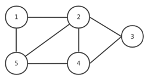
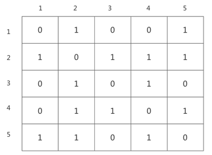
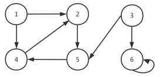
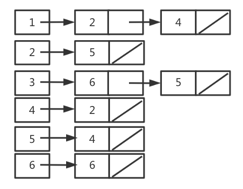
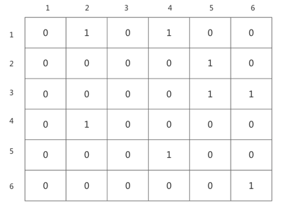

# 图算法

## 图的表示
图G = (V, E)可以有两种表示方法

- 邻接链表组合

- 邻接矩阵

两种表示法都可以表示无向图和有向图。如果表示稀疏图（边的条数｜E｜远远小于｜V｜<sup>2</sup>）通常选择邻接链表，
如果是稠密图（|E|接近｜V｜<sup>2</sup>的图）通常使用邻接矩阵表示法。如果需要快速判断任意两个节点是否有边相连，也通常选择邻接矩阵表示

对于图G =（V，E）来说，邻接链表表示由一个包含｜V｜条链表的数组Adj所构成，每个节点有一条链表，对于每个节点u ∈ V，邻接链表Adj[u]包含所有与
节点u之间有边相连的节点v，即Adj[u]包含图G中所有与u邻接的节点

无向图如下：



邻接链表表示如下：


邻接矩阵表示如下：



如果G是一个有向图，则对于边(u, v)来说，节点v将出现在链表Adj[u]中，邻接链表的长度之和等于|E|。如果G是无向图，则对于边（u，v），节点u将
出现在链表Adj[v]中，节点v将出现在链表Adj[u]中，所有邻接链表的长度之和等于2｜E｜。不论是有向图还是无向图，邻接链表表示法的存储空间均为Θ(V + E)

有向图如下：



邻接链表表示如下：


、
邻接矩阵表示如下：



对邻接链表稍加修改，即可用于表示权重图。权重图中每条边都带有一个权重值，这个权重值通常由一个w：E -> R的权重函数给出。如G = (V, E)为一个
权重图，权重函数为w，我们可以直接将边(u, v) ∈ E的权重值w(u，v)存放在节点u的邻接链表里

邻接链表的一个潜在缺陷是无法快速判断一条边（u，v）是否是图中的一条边，只能在邻接链表Adj[u]里面搜索节点v。邻接矩阵表示则克服这个缺陷，但需要
付出更大的存储空间消耗

对于邻接矩阵表示来说，我们将图G表示为一个｜V｜*｜V｜的矩阵A =（a<sub>ij</sub>），该矩阵满足下述条件

$$
a_{ij} = \left\{
\begin{array}{lr}
1 & : 若(i, j) ∈ E\\
0 & : 其他
\end{array}
\right.
$$

无向图的邻接矩阵是一个对称轴矩阵，无向图中，边(u, v)和边(v, u)是同一条边，无向图的邻接矩阵A就是自己的转置，即A = A<sup>T</sup>。某些
应用中，可能只需要存放对角线及其上的这部分邻接矩阵，从而将图存储空间需求减少差不多一半

邻接矩阵也可以用来表示权重图，如果G = (V, E)为一个权重图，其权重函数为w,则直接将边(u, v) ∈ E的权重w(u, v)存放在邻接矩阵中的第u行第v列
记录上。对于不存在的边则在相应行列记录上存放值NIL或0

邻接链表和邻接矩阵表示法在渐近意义上至少是一样的，但邻接矩阵表示法更简单，因此在图规模比较小时，更倾向于使用邻接矩阵表示法，并且无向图来说，
邻接矩阵还有一个优势，每项只需要1位空间

## 广度优先搜索
广度优先搜索是最简单的图搜索算法，也是许多重要图算法的原型。给定图G =（V，E）和一个可以识别的源结点s，广度优先搜索对图G中的边进行系统性的探索
发现可以从源结点到达的所有结点。该算法能计算从源结点s到每个可到达的结点的距离即最少边数，同时生成一颗"广度优先搜索树"。该树以源结点s为根结点，
包含所有可以从s到达的结点。对于每个从源结点s可以到达的结点v，在广度优先搜索树里从结点s到结点v的简单路径所对应的就是图G中从结点s到结点v的"最短路径"，
即包含最少边数的路径。该算法即可用于有向图也可用户无向图

广度优先搜索算法始终是将已发现结点和未发现结点，沿其广度方向向外扩展。算法需要在发现所有距离源结点s为k的所有结点之后，才会发现距离源结点s为
k+1的结点

为跟踪算法的进展，广度优先搜索在概念上将每个结点涂上白色、灰色或黑色。所有结点初始颜色均为白色。在算法的运行过程中，这些结点会变成灰色或黑色，
在搜索过程中，第一次遇到一个结点就称该结点被发现，此时结点颜色将发生变化。凡是灰色和黑色的结点都是已被发现的结点。广度优先搜索算法通过颜色区分，
确保搜索按照广度优先模式进行推进。如果边（u，v）∈ E且结点u是黑色，则结点v既可能是灰色也可能是黑色，所有与黑结点邻接的结点都是已经被发现的，
对于灰色结点其邻接结点可能存在没有被发现的白色结点。灰色结点代表的就是已知和未知两个集合的边界

在执行广度优先搜索的过程中将构造出一颗广度优先树。开始时该树只包含根结点，也就是图的源结点s。在扫描已发现结点u的邻接的邻接链表时，每当发现一个白色
结点v，就将结点v和边（u，v）同时加入该课树中。在广度优先树中，称结点u是结点v的前驱即父结点。由于每个结点最多被发现一次，最多只会有一个父结点，
广度优先树中的祖先和后代关系皆以相对于根结点s的位置来进行定义：如果结点u是从根结点s到结点v的简单路径上的一个结点，则结点u是结点v的祖先，结点
v是结点u的后代

如下是广度优先搜索过程BFS，假定输入图G =（V, E）是以邻接链表所表示。并且我们为图中每个结点赋予了一些额外属性：我们将每个结点u的颜色存放在
属性u.color中，将u的前驱结点存放在属性u.p中，如果没有前驱则u.p = NIL。属性u.d记录广度优先搜索算法所计算出的从源点s到结点u之间的距离。该算法
使用一个先进先出的队列Q来管理灰色结点集

```
BFS(G, s)
1  for each vertex u ∈ G.V - {s}
2    u.color = WHITE
3    u.d = ∞
4    u.p = NIL
5  s.color = GRAY
6  s.d = 0
7  Q = ∅
9  ENQUEUE(Q, s)
10 while Q ≠ ∅
11   u = DEQUQUE(Q)
12   for each v ∈ G.Adj[u]
13     if v.color == WHITE
14       v.color = GRAY
15       v.d = u.d + 1
16       v.p = u
17       ENQUEUE(Q, v)
18  u.color = BLACK
```

过程BFS的工作除源结点s以外，算法第1～4行将所有结点设置为白色，将每个结点u的u.d属性设置为无穷，将每个结点的父结点设置为NIL，第5行将源结点
s设置为灰色，该结点在开始时已经被发现。第6行将s.d初始化为0，第7行将源结点s的前驱设置为NIL。第8～9行对队列Q进行初始化，该队列的初始状态仅包含
源结点s

第10～18行的while循环一直执行到图中不再有灰色结点时结束。灰色结点是已被发现的结点，但其邻接链表尚未被完全检查。在第10行测试条件中，队列Q
里面包含的是灰色结点集合。在第一次循环开始之前，唯一的灰色结点，也即队列Q里的唯一结点，是源结点s。算法11行取出队列Q的队头结点s，将其从队列中
删除，第12～17行通过for循环对结点u的邻接链表中的每个结点进行检查，如果结点v为白色，则该结点未被发现，执行14～17行，将结点v设置为灰色，并
将其属性v.d加1，同时设置其父结点为u，并放入队列中。遍历完u的邻接链表后，将u颜色设置为黑色，表示与结点u邻接的所有结点都已被发现。之后继续重复
这一操作，读取队列中的灰色结点继续发现其邻接结点，设置属性，放入队列，设置灰色结点颜色为黑色。直到所有结点颜色都设置为黑色，也就是所有结点
都被发现

广度优先搜索的结果可能依赖于每个结点的邻接结点的访问顺序，广度优先树可能完全不一样，所计算出来的距离d都是一样的

广度优先搜索算法在初始化操作结束后，不会再给任何结点设置白色，第13行的测试可以确保每个结点的入队次数最多为一次，因而出队最多一次。入队、出队
时间均为O(1)，因此对队列进行操作的总时间为O(V)。算法只在一个结点出队时才对该结点的邻接链表进行扫描，所以每个邻接链表最多扫描一次。由于所有邻
接链表的长度之和是Θ(E),用于扫描邻接链表的总时间为O(E).初始化操作的时间为O(V),因此广度优先搜索算法的总运行时间为O(V + E)。广度优先搜索算法
运行时间是图G的邻接链表大小的一个线性函数

定义从源结点s到结点v的最短路径距离δ(s, v)为从结点s到结点v之间所有路径里面最少的边数。如果从结点s到结点v之间没有路径，则δ(s, v) = ∞。我们称
从结点s到结点v的长度为δ(s, v)的路径为s到v的最短距离。

给定G =（V，E），G为一个有向图或无向图，设s ∈ V为任意结点，则对于任意边（u，v）∈ E，δ(s, v) ≤ δ(s, u) + 1

设G =（V， E）为一个有向图或无向图，假定BFS以给定结点s ∈ V作为源结点在图G上运行。在BFS终结时，对于每个结点v ∈ V，BFS所计算的v.d满足v.d ≥ δ(s, v)

## 广度优先树
过程BFS在对图进行搜索的过程中将创建一颗广度优先树。该颗树对应的是p属性。也就是说,对于图G = (V, E)和源结点s，我们定义图G的前驱子图为G<sub>p</sub> = 
(V<sub>p</sub>, E<sub>p</sub>), 其中V<sub>p</sub> = {v ∈ V: v.p ≠ NIL} U {s}, E<sub>p</sub> = {(v.p, v): v ∈ V<sub>p</sub> - {s}}

如果V<sub>p</sub>由从源结点s可以到达的结点组成，并且对于所有的v ∈ V<sub>p</sub>，子图G<sub>p</sub>包含一条从源结点s到结点v的唯一简单路径，
且该路径也是图G里面从源结点s到结点v之间的一条最短路径，则前驱子图G<sub>p</sub>是一颗广度优先树。广度优先树实际上就是一颗树，并且|E<sub>p</sub>| = |V<sub>p</sub>| - 1，
我们称E<sub>p</sub>中的边为树边

当运行在一个有向或无向图G=(V, E)上时，BFS过程所建造出来的p属性使得前驱子图G<sub>p</sub> = (V<sub>p</sub>, E<sub>p</sub>)成为一颗广度优先树

## 深度优先搜索
深度优先搜索总是对最近才发现的结点v的出发边进行探索，直到该结点的所有出发边都被发现为止。一旦结点v的所有出发边都被发现，搜索则回溯到v的前驱结点，
来搜索该前驱结点的出发边。该过程一直持续到从源结点可以达到的所有结点都被发现为止。如果还存在尚未发现的结点，则深度优先搜索将从这些未发现的结点中
任选一个作为新的源结点，并重复同样的搜索过程。该算法重复整个过程，直到图中所有结点被发现为止

深度优先搜索在对已被发现的结点u的邻接链表进行扫描时，每当发现一个结点v时，将对这个事件进行记录，将v的前驱属性v<sub>p</sub>设置为u。但与广度
优先搜索不同的是，广度优先搜索的前驱子图形成一颗树，而深度优先搜索的前驱子图可能由多颗树组成，因为搜索可能从多个源结点重复进行。深度优先搜索的
前驱子图定义如下：设图G<sub>p</sub> = (V, E<sub>p</sub>),其中E<sub>p</sub> = {(v<sub>p</sub>, v): v ∈ V,切v<sub>p</sub> ≠ NIL}。
深度优先搜索的前驱子图形成一个由多棵深度优先树构成的深度优先森林。森林E<sub>p</sub>中的边仍然为树边

深度优先搜索算法在搜索过程中也是对结点进行涂色来指明结点的状态。每个结点初始颜色都是白色，结点被发现后变为灰色，在其邻接链表被扫描完成后变为黑色。
该方法可以保证每个结点仅在一颗深度优先树中出现，所有深度优先树是不相交的

深度优先搜索算法还在每个结点上添加时间戳，每个结点有两个时间戳，第一个时间戳v.d记录结点v第一次被发现的时间，第二个时间戳v.f记录的是搜索完成对v的
邻接链表扫描的时间。这些时间戳提供了图结构的重要信息，通常能够帮助推断深度优先搜索算法的行为。因为｜V｜个结点中每个结点只能有一个发现事件和一个
完成事件，所以这些时间戳都处于1和2｜V｜之间的整数。结点u在时刻u.d之前为白色，在时刻u.d和u.f之间为灰色，在时刻u.f之后为黑色

深度优先搜索算法伪代码如下，输入图G既可以是有向图，也可以是无向图
```
DFS(G)
1  for each vertex u ∈ G.V
2    u.color = WHITE
3    u.p = NIL
4  time = 0
5  for each vertex u ∈ G.V
6    if u.color == WHITE
7      DFS-VISIT(G, u)

DFS-VISIT(G, u)
1  time = time + 1
2  u.d = time
3  u.color = GRAY
4  for each v ∈ G:Adj[u]
5    if v.color == WHITE
6      v.p = u
7      DFS-VISIT(G, v)
8  u.color = BLACK
9  time = time + 1
10 u.f = time
```
DFS运行过程如下

- 1～3行将所有结点涂成白色，并将p属性设置为NIL

- 4行将全局时间计数器复位

- 5～7行依次对每个结点进行检查。当一个白色结点被发现时，则使用DFS-VISIT对结点进行访问。在第7行调用DFS-VISIT(G, u)时，结点u便成为深度优先
森林中一颗新的深度优先树的根结点。当DFS算法返回时，每个结点u都已经被赋予一个发现时间u.d和一个完成时间u.f
  
在每次对DFS-VISIT(G, u)的调用中，结点u的初始颜色都是白色

- 1行将全局变量time进行递增

- 2行使用time记录发现时间u.d

- 3行将结点u涂上灰色

- 4～7行对结点u的每个邻接结点v检查，并在v是白色情况下递归访问结点v。随着每个结点v ∈ Adj[u]在第4行被考虑，我们说深度优先搜索算法已经探索了边
  (u, v)。最后从结点u发出的每条边都被探索后
  
- 8～10行将结点u涂上黑色，对time递增，并将完成时间记录在属性u.f中

深度优先搜索算法运行时间分析：我们先排除调用DFS-VISIT的时间，第1～3行循环和第5～7行循环所需时间为Θ(V)。对每个结点v ∈ V，DFS-VISIT被调用
次数刚好为一次，因为在对一个结点调用DFS-VISIT时，该结点为白色，在DFS-VISIT中第一件事情就是将结点颜色置为灰色。在执行DFS-VISIT(G, v)的过程
中，算法第4～7行的循环所执行的次数为|Adj[v]|。由于$\sum_{v∈V}|Adj[v]|=Θ(E)$，执行DFS-VISIT第4～7行操作的总成本是Θ(E),因此深度优先搜索
算法的运行时间为Θ(V + E)

## 深度优先搜索的性质
***深度优先树的前驱子图G<sub>p</sub>形成一个由多棵树构成的森林。结点v是深度优先森林里结点u的后代当且仅当结点v在结点u为灰色的时间段被发现***

***结点发现时间和完成时间具有括号化结构。如果以结点u的起始发现时间为左括号，以u的完成发现时间为右括号，则u的子结点都在括号内，并且具有嵌套结构***

对有向图或无向图G =（V，E）进行的任意深度优先搜索中，对于任意两个结点u和v来说，下面三种清空只有一种成立

- 区间[u.d, u.f]和区间[v.d, v.f]完全分离，在深度优先森林中，结点u不是结点v的后代，结点v也不是结点u的后代

- 区间[u.d, u.f]完全包含在区间[v.d, v.f]内，深度优先树中，结点u是结点v的后代

- 区间[v.d, v.f]完全包含在区间[u.d, u.f]内，深度优先树中，结点v是结点u的后代

***在有向或无向图G的深度优先森林中，结点v是结点v的真后代当且仅当u.d < v.d < v.f < u.f成立***

在有向图或无向图G =（V，E）的深度优先森林中，结点v是结点u的后代当且仅当在发现结点u的时间u.d，存在一条从结点u到结点v的全部由白色结点所构成的
路径

### 边的分类
对于在图G上运行深度优先搜索算法所产生的深度优先森林G<sub>p</sub>，可以定义4种边的类型

- 树边：深度优先森林G<sub>p</sub>中的边。如果结点v是因算法对边(u，v)的探索而首先被发现，则（u，v）是一条树边

- 后向边：后向边（u，v）是将结点u连接到其在深度优先树中祖先结点v的边。由于有向图可以有自循环，自循环也被认为是后向边

- 前向边：将结点u连接到其在深度优先树中一个后代结点v的边（u，v）

- 横向边：指其他所有的边。这些边可以连接同一颗深度优先树中的结点，只要其中一个结点不是另一个结点的祖先，也可以连接不同深度优先树的两个结点

当遇到某些边时，DFS有足够的信息来对这些边进行分类。关键在于当第一次搜索边(u, v)时，结点v的颜色能够告诉我们关于该条边的一些信息

- 结点v为白色表明该条边(u，v)是一条树边
  
- 结点v为灰色表明该条边(u，v)是一条后向边
  
- 结点v为黑色表明该条边(u，v)是一条前向边或横向边

第一种情况，可从算法的规范中推知

第二种情况，灰色结点总是形成一条线性的后代链，这条链对应当前活跃的DFS-VISIT调用栈；灰色结点的数量总是比深度优先森林中最近被发现的结点的深度
多1。算法对图的探索总是从深度最深的灰色结点往前推进，因此从当前灰色结点通向另一个灰色结点的边所到达的是当前灰色结点的祖先

第三种情况，处理剩下的可能性

***在对无向图G进行深度优先搜索时，每条边要么是树边，要么是后向边***

## 拓扑排序
对于有向无环图G =（V，E）来说，其拓扑排序是G中所有结点的一种线性次序，满足如下条件：如果图G包含边（u，v），则结点u在拓扑排序中处于结点v的前面。
可以将图的拓扑排序看成是将图的所有结点在一条水平线上排开，图的所有有向边都是从左指向右。在许多实际应用中都需要使用有向无环图指明事件的先后顺序

对有向无环图进行拓扑排序
```
TOPOLOGICAL-SORT(G)
1 调用 DFS(G) 来计算每个结点 v 的完成时间 v.f
2 当每个结点完成时，将其插入链表的前面
3 return 返回结点的链表
```

我们可以在Θ(V + E)的时间内完成拓扑排序，因为深度优先搜索算法的运行时间为Θ(V + E)，将结点插入到链表最前端所需要的时间为Θ(1)，一共有|V|个
结点需要插入

***一个有向图G =（V，E）是无环的当且仅当对其进行的深度优先搜索不产生后向边***

***拓扑排序算法TOPOLOGICAL-SORT(G)生成的是有向无环图的拓扑排序***

## 强连通分量
使用深度优先搜索来将有向图分解为强连通分量。许多针对有向图的算法都以这种分解操作开始，在将图分解为强连通分量后，这些算法将分别运行在每个连通
分量上，之后根据连通分量之间的连接结构将各个结果组合起来，从而获得最终的结果

有向图G=（V，E）的强连通分量是一个最大结点集合C ⊆ V，对于该集合中的任意一对结点u和v来说，路径u～>v和路径v~>u同时存在；也就是说结点u和结点
v可以互相到达

在寻找强连通分量时我们需要用到图G=（V，E）的转置，其转置图我们定义为G<sup>T</sup> = (V, E<sup>T</sup>)，这里E<sup>T</sup> = {(u, v): (v, u) ∈ E}。
E<sup>T</sup>是对图G的边进行反向而来。给定图G的邻接链表，创建G<sup>T</sup>的事件为O(V + E)。图G和图G<sup>T</sup>的强连通分量完全相同：
u和v在图G中可以相互到达当且仅当他们在图G<sup>T</sup>中可以相互到达

一下算法通过两次深度优先搜索来计算有向图G = (V, E)的强连通分量。这两次深度搜索一次运行在图G上，一次运行在转置图G<sup>T</sup>上
```
STRONGLY-CONNECTED-COMPONENTS(G)
1 调用DFS(G)计算每个结点u的深度搜索完成时间u.f
2 生成转置图
3 调用DFS(转置图)，在DFS主循环中，需要按u.f递减的顺序考虑结点（类似第1行处理方式）
4 将第 3 行形成的深度优先森林中每棵树的结点作为单独的强连通分量输出
```
***设C和C'为有向图G=（V，E）的两个不同的强连通分量，设结点u, v ∈ C，结点u'，v' ∈ C',假定图G包含一条从结点u到结点u'的路径u～>u'。那么图G
不可能包含一条从结点v'到结点v的路径v'～>v'***

***设C和C'为有向图G=（V，E）的两个不同的强连通分量。假如存在一条边（u，v）∈ E，u ∈ C，v ∈ C'，则f(C) > F(C')。f函数为完成时间***

***设C和C'为有向图G=（V，E）的两个不同的强连通分量。假如存在一条边（u，v）∈ E<sup>T</sup>，u ∈ C，v ∈ C'，则f(C) < F(C')。f函数为完成时间***

